# 6 முக்கோணவியல்

> "இயற்கையை ஆழமாக புரிந்துகொள்வதே கணிதக் கண்டுபிடிப்புகளின் பயன்தரு மூலமாகும்." —ஜோசப் ஃ.போரியோ

பிரஞ்சு கணித மேதை பிரான்கோயிஸ் வியட்டா இயற்கணிதச் சமன்பாடுகளைத் தீர்ப்பதற்குப் பொருத்தமான முக்கோணவியல் சார்புகளைப் பயன்படுத்தினார். அவருடைய புகழ்பெற்ற $\pi$ சூத்திரமானது முக்கோணவியல் விகிதங்களைப் பயன்படுத்துவதன் மூலமாகப் பெறப்பட்டது. அவர் இயற்றிய "Canon Mathematics" என்ற புகழ்மிக்க நூல் முக்கோணவியல் சார்ந்த அட்டவணைகளைக் கணித ரீதியாக எவ்வாறு உருவாக்கலாம் என்ற குறிப்பையும் தள மற்றும் கோள முக்கோணங்களின் தீர்வைப்பற்றியும் கூறுகிறது. அதிகபட்சம் அறுபடிட்தான சமன்பாகுளுக்குத் தீர்வு காண்பது, மூலங்களைக் கண்டறிவது ஆகிய முறைகளையும் இவர் கோயிஸ் அளித்துள்ளார். கணிதத்தில் 'கெழு' என்ற சொல்லை முதன்முதலில் பயன்படுத்தியவர் இவரே. சமன்பாகுளின் மூலங்களுக்கும், கெழுக்களுக்கும் இடையேயுள்ள தொடர்பை, ஒரு சாதாரணச் சூத்திரத்தின் மூலம் இவர் நமக்கு விளக்கியுள்ளார். மேலும், வடிவியல் முறையில் கனச் சதுரத்தை இரு மடங்காக்குவது, ஒரு கோணத்தை மூன்று சமபாகமாகப் பிரிப்பது போன்ற கணக்குகளையும் இவர் வழங்கியுள்ளார். இரகசியக் குறியீடு செய்திகளிலிருந்து தேவையான செய்தியைக் கண்டறியும் கணித முறையை வழங்கியுள்ளார்.

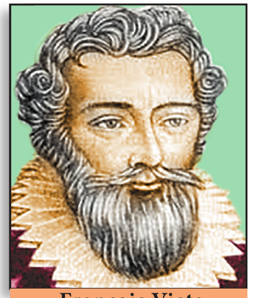

## கற்றல் விளைவுகள்

- முக்கோணவியல் விகிதங்களை நினைவு கூர்தல்.
- முக்கோணவியல் விகிதங்களுக்கு இடையேயுள்ள அடிப்படைத் தொடர்புகளை நினைவுபடுத்துதல்.
- நிரப்பு கோணங்களின் முக்கோணவியல் விகிதங்களை நினைவு கூர்தல்.
- முக்கோணவியல் முற்றொருமைகளைப் புரிந்துகொள்ளல்.
- பல்வேறு வகையான பொருட்களின் உயரம் மற்றும் தொலைவுகள் சார்ந்த கணக்குகளுக்குத் தீர்வு காணும் வழிமுறைகளை அறிதல்.

## 6.1 அறிமுகம் (Introduction)

பழங்காலத்தில் நில அளவையாளர்கள், மாலுமிகள் மற்றும் விண்வெளி ஆராய்ச்சியாளர்கள் ஆகியோர் நேரடியாகக் கண்டறிய முடியாத தொலைவுகளை முக்கோணத்தைப் பயன்படுத்திக் கண்டறிந்துள்ளனர். இதுவே கணிதவியலின் கிளையான முக்கோணவியல் உருவாகுவதற்குக் காரணமாக அமைந்தது.

ரோட்ஸ் தீவில் கி.மு. (பொ.ஆ.மு) 200 இல் வாழ்ந்த ஹிப்பார்கஸ், மிகப்பெரிய நாணுடைய $360\times 60 = 21600$ அலகுகள் சுற்றளவு (அதாவது, சுற்றளவின் 1 அலகானது வில்லின் ஒவ்வொரு நிமிடத்திற்கும் சமமாக) கொண்ட வட்டத்தை உருவாக்கினார். இது முக்கோணவியலின் வளர்ச்சிக்குப் பெரும் அடிட்தளமாக அமைந்தது. எனவே ஹிப்பார்கஸ் "முக்கோணவியலின் தந்தை" என அழைக்கப்படுகிறார்.

கி.பி. (பொ.ஆ) ஐந்தாம் நூற்றாண்டின் இந்திய அறிஞர்கள், அரைக் கோணத்திற்கான அரை நாண்களை எடுத்துக்கொண்டு தீர்வு கண்டபோது அது வானியல் கணிதத்தின் சுருங்கிய வடிவமே என்பதை உணர்ந்தனர். கணித மேதைகளான ஆரியபட்டா, பாஸ்கரா –I, II மற்றும் சிலரும் அரை நாண்களின் (Jya) மதிப்புகளைக் கணக்கிடுவதற்கு எளிய வழிமுறைகளைக் கொண்டு வந்தனர்.

பாக்தாத்தின் கணித மேதை அபு-அல்-வஃபா என்பவர் தொடுகோட்டுச் (tangent) சார்புகளை உருவாக்கினார். அவர் அதை நிழல் (Shadow) என அழைத்தார். அரேபிய அறிஞர்களுக்கு ஜியா (Jya) எனும் சொல்லை எவ்வாறு மொழிபெயர்த்து எழுதுவது எனத் தெரியவில்லை. ஆகவே அவர்கள் தோராயமாக ஜிபா (Jiba) என்ற சொல்லைப் பயன்படுத்தினர்.

அரேபியச் சொல் ஜிபா (Jiba)வானது காவ் (cove) அல்லது பே (bay) என மாற்றம் பெற்று இலத்தீன் மொழியில் சைனஸ் ('sinus') என அழைக்கப்பட்டது. சைனஸ் என்ற சொல் அரை-நாணைக் குறிக்கப் பயன்படுத்தப்பட்டது. இந்தச் சொல்லையே இன்று நாம் சைன் ('sine') என அழைக்கிறோம். "முக்கோணவியல்" என்ற சொல்லானது கி.பி (பொ.ஆ) 17ஆம் நூற்றாண்டின் தொடக்கத்தில் ஜெர்மன் கணித மேதை பார்தோலோமஸ் பிடிஸ்கஸ் என்பவரால் கண்டுபிடிக்கப்பட்டது.

### நினைவு கூர்தல்

##### முக்கோணவியல் விகிதங்கள்

இங்கு $0^\circ < \theta < 90^\circ$ என்க.

செங்கோண முக்கோணம் $OMP$-யில்

$$\sin\theta = \frac{\text{எதிர்ப்பக்கம்}}{\text{கர்ணம்}} = \frac{MP}{OP}$$

$$\cos\theta = \frac{\text{அடுத்துள்ள பக்கம்}}{\text{கர்ணம்}} = \frac{OM}{OP}$$

மேற்கண்ட இரண்டு முக்கோண விகிதங்களிலிருந்து மற்ற நான்கு முக்கோணவியல் விகிதங்களைப் பின்வருமாறு எழுதலாம்.

$$\tan\theta = \frac{\sin\theta}{\cos\theta};\ \cot\theta = \frac{\cos\theta}{\sin\theta};\ \operatorname{cosec}\theta = \frac{1}{\sin\theta};\ \sec\theta = \frac{1}{\cos\theta}$$

>**குறிப்பு**
>
>$\theta$-வை ஒரு கோணமாகக் கொண்ட எல்லா செங்கோண முக்கோணங்களும் வடிவொத்தவையாக இருக்கும். எனவே, இவ்வாறான செங்கோண முக்கோணத்தில் வரையறுக்கப்பட்ட முக்கோணவியல் விகிதங்களானது தேர்ந்தெடுக்கப்படும் முக்கோணங்களைப் பொருத்து அமையாது.

##### நிரப்புக் கோணங்களின் முக்கோணவியல் விகிதங்கள்

| | | |
|---|---|---|
| $\sin(90^\circ-\theta) = \cos\theta$ | $\cos(90^\circ-\theta) = \sin\theta$ | $\tan(90^\circ-\theta) = \cot\theta$ |
| $\operatorname{cosec}(90^\circ-\theta) = \sec\theta$ | $\sec(90^\circ-\theta) = \operatorname{cosec}\theta$ | $\cot(90^\circ-\theta) = \tan\theta$ |

##### முக்கோணவியல் நிரப்பு கோணங்களுக்கான காட்சி மெய்ம்மை நிருபணம்

படத்தில் காட்டியுள்ளவாறு ஓர் அலகு ஆரமுடைய அரைவட்டத்தை எடுத்துக்கொள்வோம்.

$\angle QOP = \theta$ என்க.

எனவே, $\angle QOR = 90^\circ - \theta$, இங்கு, $OPQR$ என்பது ஒரு செவ்வகம் ஆகும்.

முக்கோணம் $OPQ$-விலிருந்து, $\dfrac{OP}{OQ} = \cos\theta$

ஆனால், $OQ = $ ஆரம் $= 1$

எனவே, $OP = OQ\times\cos\theta = \cos\theta$

இதேபோல, $\dfrac{PQ}{OQ} = \sin\theta$

எனவே, $PQ = OQ\times\sin\theta = \sin\theta$ (ஏனெனில் $OQ=1$)

$OP = \cos\theta,\ PQ = \sin\theta \quad \ldots(1)$

இப்பொழுது முக்கோணம் $QOR$-விலிருந்து நாம் பெறுவது,

$$\frac{OR}{OQ} = \cos(90^\circ-\theta)$$

எனவே, $OR = OQ\cos(90^\circ-\theta)$

ஆகவே, $OR = \cos(90^\circ-\theta)$

இதுபோலவே, $\dfrac{RQ}{OQ} = \sin(90^\circ-\theta)$

மேலும், $RQ = \sin(90^\circ-\theta)$

$OR = \cos(90^\circ-\theta),\ RQ = \sin(90^\circ-\theta) \quad \ldots(2)$

$OPQR$ என்பது செவ்வகம் என்பதால், $OP = RQ$ மற்றும் $OR = PQ$

எனவே $(1)$, $(2)$-விலிருந்து கிடைக்கப்பெறுவன,

$$\boxed{\sin(90^\circ-\theta) = \cos\theta} \text{ மற்றும் } \boxed{\cos(90^\circ-\theta) = \sin\theta}$$

>**குறிப்பு**
>
>| | |
>|---|---|
>| $(\sin\theta)^2 = \sin^2\theta$ | $(\operatorname{cosec}\theta)^2 = \operatorname{cosec}^2\theta$ |
>| $(\cos\theta)^2 = \cos^2\theta$ | $(\sec\theta)^2 = \sec^2\theta$ |
>| $(\tan\theta)^2 = \tan^2\theta$ | $(\cot\theta)^2 = \cot^2\theta$ |

##### $0^\circ, 30^\circ, 45^\circ, 60^\circ, 90^\circ$-க்கான முக்கோணவியல் விகிதங்களின் அட்டவணை

| முக்கோணவியல் விகிதங்கள் \ $\theta$ | $0^\circ$ | $30^\circ$ | $45^\circ$ | $60^\circ$ | $90^\circ$ |
|---|---|---|---|---|---|
| $\sin\theta$ | $0$ | $\frac{1}{2}$ | $\frac{1}{\sqrt{2}}$ | $\frac{\sqrt{3}}{2}$ | $1$ |
| $\cos\theta$ | $1$ | $\frac{\sqrt{3}}{2}$ | $\frac{1}{\sqrt{2}}$ | $\frac{1}{2}$ | $0$ |
| $\tan\theta$ | $0$ | $\frac{1}{\sqrt{3}}$ | $1$ | $\sqrt{3}$ | வரையறுக்க இயலாது |
| $\operatorname{cosec}\theta$ | வரையறுக்க இயலாது | $2$ | $\sqrt{2}$ | $\frac{2}{\sqrt{3}}$ | $1$ |
| $\sec\theta$ | $1$ | $\frac{2}{\sqrt{3}}$ | $\sqrt{2}$ | $2$ | வரையறுக்க இயலாது |
| $\cot\theta$ | வரையறுக்க இயலாது | $\sqrt{3}$ | $1$ | $\frac{1}{\sqrt{3}}$ | $0$ |

>**சிந்தனைக் களம்**
>
>1. $\sin\theta$ மற்றும் $\cos\theta$-வின் மதிப்புகள் எப்போது சமமாக இருக்கும்?
>2. $\sin\theta = 2$ எனில், $\theta$-ன் மதிப்பு என்ன?
>3. $\theta$-ன் மதிப்பு $0^\circ$-லிருந்து $90^\circ$ வரை அதிகரிக்கிறது எனில், ஆறு முக்கோணவியல் விகிதங்களில் எவை வரையறுக்கப்படாத மதிப்புகளைப் பெற்றிருக்கும்?
>4. எட்டு முக்கோணவியல் விகிதங்கள் இருப்பதற்குச் சாத்தியமுண்டா?
>5. $0^\circ \le \theta \le 90^\circ$ என்க. $\theta$-ன் மதிப்புகளுக்குப் பின்வருவனவற்றில் எது உண்மையாகும்?
>
>   (i) $\sin\theta > \cos\theta$ &emsp; (ii) $\cos\theta > \sin\theta$ &emsp; (iii) $\sec\theta = 2\tan\theta$ &emsp; (iv) $\operatorname{cosec}\theta = 2\cot\theta$

## 6.2 முக்கோணவியல் முற்றொருமைகள் (Trigonometric Identities)

$\theta$-ன் எல்லா மெய்யெண் மதிப்புகளுக்கும் பின்வரும் மூன்று முற்றொருமைகளைப் பெறலாம்.

(i) $\sin^2\theta + \cos^2\theta = 1$ &emsp; (ii) $1 + \tan^2\theta = \sec^2\theta$ &emsp; (iii) $1 + \cot^2\theta = \operatorname{cosec}^2\theta$

மேற்கண்ட மூன்று முற்றொருமைகளும் முக்கோணவியலின் அடிப்படை முற்றொருமைகள் என அழைக்கப்படுகின்றன.

இம்முற்றொருமைகளைக் கீழ்க்காணுமாறு நிருபிக்கலாம்.

| படம் | முற்றொருமை | நிருபணம் |
|---|---|---|
|  | $\sin^2\theta + \cos^2\theta = 1$ | செங்கோண முக்கோணம் $OMP$-ல் $\dfrac{OM}{OP}=\cos\theta,\ \dfrac{PM}{OP}=\sin\theta \ \ldots(1)$ பிதாகரஸ் தேற்றத்தின்படி, $MP^2 + OM^2 = OP^2 \ \ldots(2)$ $(2)$ ஐ $OP^2$-ஆல் இருபுறமும் வகுக்க (இங்கு $OP\neq 0$) நாம் பெறுவது, $\dfrac{MP^2}{OP^2} + \dfrac{OM^2}{OP^2} = \dfrac{OP^2}{OP^2}$ $\left(\dfrac{MP}{OP}\right)^2 + \left(\dfrac{OM}{OP}\right)^2 = \left(\dfrac{OP}{OP}\right)^2$ என்பதால் $(1)$-லிருந்து, $(\sin\theta)^2 + (\cos\theta)^2 = 1^2$ ஆகவே, $\sin^2\theta + \cos^2\theta = 1$ |
| | $1 + \tan^2\theta = \sec^2\theta$ | செங்கோண முக்கோணம் $OMP$-ல் $\dfrac{MP}{OM}=\tan\theta,\ \dfrac{OP}{OM}=\sec\theta \ \ldots(3)$ $(2)$-லிருந்து, $MP^2 + OM^2 = OP^2$ $(2)$-ஐ $OM^2$-ஆல் இருபுறமும் வகுக்க (இங்கு $OM\neq 0$) நமக்குக் கிடைப்பது $\dfrac{MP^2}{OM^2} + \dfrac{OM^2}{OM^2} = \dfrac{OP^2}{OM^2}$ $\left(\dfrac{MP}{OM}\right)^2 + \left(\dfrac{OM}{OM}\right)^2 = \left(\dfrac{OP}{OM}\right)^2$ என்பதால் $(3)$-லிருந்து $(\tan\theta)^2 + 1^2 = (\sec\theta)^2$ ஆகவே $1 + \tan^2\theta = \sec^2\theta$. |
| | $1 + \cot^2\theta = \operatorname{cosec}^2\theta$ | செங்கோண முக்கோணம் $OMP$-ல் $\dfrac{OM}{MP}=\cot\theta,\ \dfrac{OP}{MP}=\operatorname{cosec}\theta \ \ldots(4)$ $(2)$-லிருந்து, $MP^2 + OM^2 = OP^2$ $(2)$-ஐ $MP^2$-ஆல் இருபுறமும் வகுக்க, (இங்கு $MP\neq 0$) நாம் பெறுவது, $\dfrac{MP^2}{MP^2} + \dfrac{OM^2}{MP^2} = \dfrac{OP^2}{MP^2}$ $\left(\dfrac{MP}{MP}\right)^2 + \left(\dfrac{OM}{MP}\right)^2 = \left(\dfrac{OP}{MP}\right)^2$ என்பதால் $(4)$-லிருந்து, $1^2 + (\cot\theta)^2 = (\operatorname{cosec}\theta)^2$ ஆகவே, $1 + \cot^2\theta = \operatorname{cosec}^2\theta$ |

**இந்த முக்கோணவியல் முற்றொருமைகளைப் பின்வருமாறு மாற்றி எழுதலாம்.**

| முற்றொருமை | மாற்று அமைப்புகள் |
|---|---|
| $\sin^2\theta + \cos^2\theta = 1$ | $\sin^2\theta = 1 - \cos^2\theta$ (அல்லது) $\cos^2\theta = 1 - \sin^2\theta$ |
| $1 + \tan^2\theta = \sec^2\theta$ | $\tan^2\theta = \sec^2\theta - 1$ (அல்லது) $\sec^2\theta - \tan^2\theta = 1$ |
| $1 + \cot^2\theta = \operatorname{cosec}^2\theta$ | $\cot^2\theta = \operatorname{cosec}^2\theta - 1$ (அல்லது) $\operatorname{cosec}^2\theta - \cot^2\theta = 1$ |

>**குறிப்பு**
>
>மேற்கண்ட முக்கோணவியல் முற்றொருமைகள் $\theta$-வின் அனைத்து மதிப்புகளுக்கும் உண்மையாகும். ஆனால், நாம் ஆறு முக்கோணவியல் விகிதக் கோணங்களை $0^\circ < \theta < 90^\circ$ என மட்டும் எடுத்துக்கொள்வோம்.

>**செயல்பாடு 1**
>
>ஒரு வெள்ளைத்தாளில் படம் 6.4(i)-ல் உள்ளவாறு $OX$, $OY$ என்ற இரு செங்குத்துக் கோடுகள் $O$-ல் சந்திக்குமாறு அமைக்கவும்.
>
>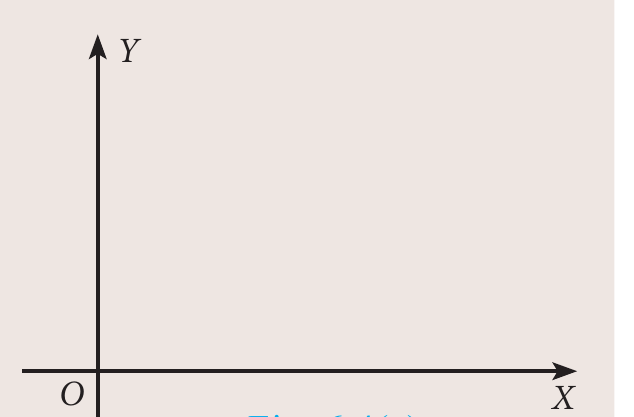
>
>$OX$ என்பதை $X$ அச்சாகவும், $OY$ என்பதை $Y$ அச்சாகவும் எடுத்துக்கொள்வோம்.
>
>$\theta$-ன் குறிப்பிட்ட கோணங்களுக்கு $\sin\theta$ மற்றும் $\cos\theta$-ன் மதிப்புகளைச் சரிபார்க்கலாம்.
>
>இங்கு, $\theta = 30^\circ$ என்க.
>
>படம் 6.4(ii)-ல் உள்ளவாறு எதாவது ஒரு நீளத்திற்குக் கோட்டுத் துண்டு $OA$, $\angle AOX = 30^\circ$ என்றவாறு அமைக்க. $B$-யில் சந்திக்குமாறு $A$-யிலிருந்து $OX$-க்கு ஒரு செங்குத்துக்கோடு வரைக.
>
>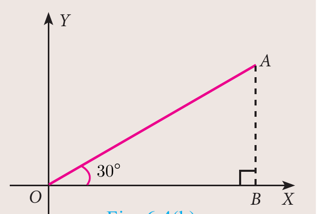
>
>இப்பொழுது அளவுகோலைப் பயன்படுத்தி, $AB$, $OB$ மற்றும் $OA$-வின் நீளத்தை அளக்கவும்.
>
>விகிதங்கள் $\dfrac{AB}{OA}$, $\dfrac{OB}{OA}$ மற்றும் $\dfrac{AB}{OB}$ ஆகியவற்றைக் காண்க.
>
>இதிலிருந்து என்ன கிடைக்கிறது? இந்த மதிப்புகளை முக்கோணவியல் அட்டவணை மதிப்புகளுடன் ஒப்பிடலாமா? உங்கள் முடிவு என்னவாக இருக்கும்?
>
>இதேபோல, $\theta = 45^\circ$ மற்றும் $\theta = 60^\circ$ ஆகிய கோணங்களுக்கும் மேற்கண்ட மூன்று மதிப்புகளைக் காண்க. இதன் மூலம் நீங்கள் அறிவது என்ன?

#### எடுத்துக்காட்டு 6.1

$\tan^2\theta - \sin^2\theta = \tan^2\theta\sin^2\theta$ என்பதை நிரூபிக்கவும்.

**தீர்வு**

$$\begin{aligned}
\tan^2\theta - \sin^2\theta &= \tan^2\theta - \frac{\sin^2\theta}{\cos^2\theta}.\cos^2\theta \\
&= \tan^2\theta(1-\cos^2\theta) = \tan^2\theta\sin^2\theta
\end{aligned}$$

#### எடுத்துக்காட்டு 6.2

$\dfrac{\sin A}{1+\cos A} = \dfrac{1-\cos A}{\sin A}$ என்பதை நிரூபிக்கவும்.

**தீர்வு**

$$\begin{aligned}
\frac{\sin A}{1+\cos A} &= \frac{\sin A}{1+\cos A}\times\frac{1-\cos A}{1-\cos A} \quad [1+\cos A \text{ யின் இணையைக் கொண்டு தொகுதி மற்றும் பகுதியைப் பெருக்கவும்}] \\
&= \frac{\sin A(1-\cos A)}{(1+\cos A)(1-\cos A)} = \frac{\sin A(1-\cos A)}{1-\cos^2 A} \\
&= \frac{\sin A(1-\cos A)}{\sin^2 A} = \frac{1-\cos A}{\sin A}
\end{aligned}$$

#### எடுத்துக்காட்டு 6.3

$1 + \dfrac{\cot^2\theta}{1+\operatorname{cosec}\theta} = \operatorname{cosec}\theta$ என்பதை நிரூபிக்கவும்.

**தீர்வு**

$$\begin{aligned}
1 + \frac{\cot^2\theta}{1+\operatorname{cosec}\theta} &= 1 + \frac{\operatorname{cosec}^2\theta - 1}{\operatorname{cosec}\theta + 1} \quad [\text{ஏனெனில் } \operatorname{cosec}^2\theta - 1 = \cot^2\theta] \\
&= 1 + \frac{(\operatorname{cosec}\theta+1)(\operatorname{cosec}\theta-1)}{\operatorname{cosec}\theta+1} \\
&= 1 + (\operatorname{cosec}\theta - 1) = \operatorname{cosec}\theta
\end{aligned}$$

#### எடுத்துக்காட்டு 6.4

$\sec\theta - \cos\theta = \tan\theta\sin\theta$ என்பதை நிரூபிக்கவும்.

**தீர்வு**

$$\begin{aligned}
\sec\theta - \cos\theta &= \frac{1}{\cos\theta} - \cos\theta = \frac{1-\cos^2\theta}{\cos\theta} \\
&= \frac{\sin^2\theta}{\cos\theta} \quad [\text{ஏனெனில் } 1-\cos^2\theta = \sin^2\theta] \\
&= \frac{\sin\theta}{\cos\theta}\times\sin\theta = \tan\theta\sin\theta
\end{aligned}$$

#### எடுத்துக்காட்டு 6.5

$\sqrt{\dfrac{1+\cos\theta}{1-\cos\theta}} = \operatorname{cosec}\theta + \cot\theta$ என்பதை நிரூபிக்கவும்.

**தீர்வு**

$$\begin{aligned}
\sqrt{\frac{1+\cos\theta}{1-\cos\theta}} &= \sqrt{\frac{1+\cos\theta}{1-\cos\theta}\times\frac{1+\cos\theta}{1+\cos\theta}} \quad [1-\cos\theta \text{ யின் இணையைக் கொண்டு தொகுதி மற்றும் பகுதியைப் பெருக்கவும்}] \\
&= \sqrt{\frac{(1+\cos\theta)^2}{1-\cos^2\theta}} = \frac{1+\cos\theta}{\sqrt{\sin^2\theta}} \quad [\text{ஏனெனில் } \sin^2\theta + \cos^2\theta = 1] \\
&= \frac{1+\cos\theta}{\sin\theta} = \operatorname{cosec}\theta+\cot\theta
\end{aligned}$$

#### எடுத்துக்காட்டு 6.6

$\dfrac{\sec\theta}{\sin\theta} - \dfrac{\sin\theta}{\cos\theta} = \cot\theta$ என்பதை நிரூபிக்கவும்.

**தீர்வு**

$$\begin{aligned}
\frac{\sec\theta}{\sin\theta} - \frac{\sin\theta}{\cos\theta} &= \frac{\frac{1}{\cos\theta}}{\sin\theta} - \frac{\sin\theta}{\cos\theta} = \frac{1}{\sin\theta\cos\theta} - \frac{\sin\theta}{\cos\theta} \\
&= \frac{1-\sin^2\theta}{\sin\theta\cos\theta} = \frac{\cos^2\theta}{\sin\theta\cos\theta} = \cot\theta
\end{aligned}$$

#### எடுத்துக்காட்டு 6.7

$\sin^2 A\cos^2 B + \cos^2 A\sin^2 B + \cos^2 A\cos^2 B + \sin^2 A\sin^2 B = 1$ என்பதை நிரூபிக்கவும்.

**தீர்வு**

$$\begin{aligned}
&\sin^2 A\cos^2 B + \cos^2 A\sin^2 B + \cos^2 A\cos^2 B + \sin^2 A\sin^2 B \\
&= \sin^2 A\cos^2 B + \sin^2 A\sin^2 B + \cos^2 A\sin^2 B + \cos^2 A\cos^2 B \\
&= \sin^2 A(\cos^2 B + \sin^2 B) + \cos^2 A(\sin^2 B + \cos^2 B) \\
&= \sin^2 A(1) + \cos^2 A(1) \quad (\text{ஏனெனில் } \sin^2 B + \cos^2 B = 1) \\
&= \sin^2 A + \cos^2 A = 1
\end{aligned}$$

#### எடுத்துக்காட்டு 6.8

$\cos\theta + \sin\theta = \sqrt{2}\cos\theta$ எனில், $\cos\theta - \sin\theta = \sqrt{2}\sin\theta$ என நிரூபிக்க.

**தீர்வு**

இப்பொழுது, $\cos\theta + \sin\theta = \sqrt{2}\cos\theta$ என்பதை இருபுறமும் வர்க்கப்படுத்துக.

$$\begin{aligned}
(\cos\theta + \sin\theta)^2 &= (\sqrt{2}\cos\theta)^2 \\
\cos^2\theta + \sin^2\theta + 2\sin\theta\cos\theta &= 2\cos^2\theta \\
2\cos^2\theta - \cos^2\theta - \sin^2\theta &= 2\sin\theta\cos\theta \\
\cos^2\theta - \sin^2\theta &= 2\sin\theta\cos\theta \\
(\cos\theta + \sin\theta)(\cos\theta - \sin\theta) &= 2\sin\theta\cos\theta \\
\cos\theta - \sin\theta = \frac{2\sin\theta\cos\theta}{\cos\theta + \sin\theta} &= \frac{2\sin\theta\cos\theta}{\sqrt{2}\cos\theta} \quad (\text{ஏனெனில் } \cos\theta + \sin\theta = \sqrt{2}\cos\theta) \\
&= \sqrt{2}\sin\theta
\end{aligned}$$

$\therefore\ \cos\theta - \sin\theta = \sqrt{2}\sin\theta$.

#### எடுத்துக்காட்டு 6.9

$(\operatorname{cosec}\theta - \sin\theta)(\sec\theta - \cos\theta)(\tan\theta + \cot\theta) = 1$ என்பதை நிரூபிக்கவும்.

**தீர்வு**

$$\begin{aligned}
&(\operatorname{cosec}\theta - \sin\theta)(\sec\theta - \cos\theta)(\tan\theta + \cot\theta) \\
&= \left(\frac{1}{\sin\theta} - \sin\theta\right)\left(\frac{1}{\cos\theta} - \cos\theta\right)\left(\frac{\sin\theta}{\cos\theta} + \frac{\cos\theta}{\sin\theta}\right) \\
&= \frac{1-\sin^2\theta}{\sin\theta}\times\frac{1-\cos^2\theta}{\cos\theta}\times\frac{\sin^2\theta + \cos^2\theta}{\sin\theta\cos\theta} \\
&= \frac{\cos^2\theta\sin^2\theta\times 1}{\sin^2\theta\cos^2\theta} = 1
\end{aligned}$$

#### எடுத்துக்காட்டு 6.10

$\dfrac{\sin A}{1+\cos A} + \dfrac{\sin A}{1-\cos A} = 2\operatorname{cosec}\text{A}$ என்பதை நிரூபிக்கவும்.

**தீர்வு**

$$\begin{aligned}
&\frac{\sin A}{1+\cos A} + \frac{\sin A}{1-\cos A} \\
&= \frac{\sin A(1-\cos A) + \sin A(1+\cos A)}{(1+\cos A)(1-\cos A)} \\
&= \frac{\sin A - \sin A\cos A + \sin A + \sin A\cos A}{1-\cos^2 A} \\
&= \frac{2\sin A}{1-\cos^2 A} = \frac{2\sin A}{\sin^2 A} = 2\operatorname{cosec}\text{A}
\end{aligned}$$

#### எடுத்துக்காட்டு 6.11

$\operatorname{cosec}\theta + \cot\theta = P$ எனில், $\cos\theta = \dfrac{P^2-1}{P^2+1}$ என்பதை நிரூபிக்கவும்.

**தீர்வு**

$\operatorname{cosec}\theta + \cot\theta = P$ எனக் கொடுக்கப்பட்டுள்ளது $\quad \ldots(1)$

$$\operatorname{cosec}^2\theta - \cot^2\theta = 1 \text{ (முற்றொருமை)}$$

$$\operatorname{cosec}\theta - \cot\theta = \frac{1}{\operatorname{cosec}\theta + \cot\theta}$$

$$\operatorname{cosec}\theta - \cot\theta = \frac{1}{P} \quad \ldots(2)$$

$(1)$ மற்றும் $(2)$ ஆகியவற்றைக் கூட்டக்கிடைப்பது, $2\operatorname{cosec}\theta = P + \dfrac{1}{P}$

$$2\operatorname{cosec}\theta = \frac{P^2+1}{P} \quad \ldots(3)$$

$(2)$-விலிருந்து $(1)$-ஐக் கழித்தால் கிடைப்பது, $2\cot\theta = P - \dfrac{1}{P}$

$$2\cot\theta=\frac{P^2-1}{P}\qquad\ldots(4)$$

$(4)$-ஐ $(3)$-ஆல் வகுக்கக் கிடைப்பது, $\dfrac{2\cot\theta}{2\operatorname{cosec}\theta}=\dfrac{P^2-1}{P}\times\dfrac{P}{P^2+1}$

$$\Rightarrow\cos\theta=\dfrac{P^2-1}{P^2+1} \text{ எனக் கிடைக்கிறது.}$$

#### எடுத்துக்காட்டு 6.12

$\tan^2 A-\tan^2 B=\dfrac{\sin^2 A-\sin^2 B}{\cos^2 A\cos^2 B}$ என்பதை நிரூபிக்கவும்.

**தீர்வு**

$$\begin{aligned}
\tan^2 A-\tan^2 B&=\frac{\sin^2 A}{\cos^2 A}-\frac{\sin^2 B}{\cos^2 B}\\
&=\frac{\sin^2 A\cos^2 B-\sin^2 B\cos^2 A}{\cos^2 A\cos^2 B}\\
&=\frac{\sin^2 A(1-\sin^2 B)-\sin^2 B(1-\sin^2 A)}{\cos^2 A\cos^2 B}\\
&=\frac{\sin^2 A-\sin^2 A\sin^2 B-\sin^2 B+\sin^2 A\sin^2 B}{\cos^2 A\cos^2 B}=\frac{\sin^2 A-\sin^2 B}{\cos^2 A\cos^2 B}
\end{aligned}$$

#### எடுத்துக்காட்டு 6.13

$\left(\dfrac{\cos^3 A-\sin^3 A}{\cos A-\sin A}\right)-\left(\dfrac{\cos^3 A+\sin^3 A}{\cos A+\sin A}\right)=2\sin A\cos A$ என்பதை நிரூபிக்கவும்.

**தீர்வு**

$$\begin{aligned}
&\left(\frac{\cos^3 A-\sin^3 A}{\cos A-\sin A}\right)-\left(\frac{\cos^3 A+\sin^3 A}{\cos A+\sin A}\right)\\
&=\left(\frac{(\cos A-\sin A)(\cos^2 A+\sin^2 A+\cos A\sin A)}{\cos A-\sin A}\right)\qquad\left[\text{ஏனெனில்}\ \begin{aligned}a^3-b^3&=(a-b)(a^2+b^2+ab)\\a^3+b^3&=(a+b)(a^2+b^2-ab)\end{aligned}\right]\\
&\quad-\left(\frac{(\cos A+\sin A)(\cos^2 A+\sin^2 A-\cos A\sin A)}{\cos A+\sin A}\right)\\
&=(1+\cos A\sin A)-(1-\cos A\sin A)\\
&=2\cos A\sin A
\end{aligned}$$

#### எடுத்துக்காட்டு 6.14

$\dfrac{\sin A}{\sec A+\tan A-1}+\dfrac{\cos A}{\operatorname{cosec}A+\cot A-1}=1$ என்பதை நிரூபிக்கவும்.

**தீர்வு**

$$\begin{aligned}
&\frac{\sin A}{\sec A+\tan A-1}+\frac{\cos A}{\operatorname{cosec}A+\cot A-1}\\
&=\frac{\sin A(\operatorname{cosec}A+\cot A-1)+\cos A(\sec A+\tan A-1)}{(\sec A+\tan A-1)(\operatorname{cosec}A+\cot A-1)}\\
&=\frac{\sin A\operatorname{cosec}A+\sin A\cot A-\sin A+\cos A\sec A+\cos A\tan A-\cos A}{(\sec A+\tan A-1)(\operatorname{cosec}A+\cot A-1)}\\
&=\frac{1+\cos A-\sin A+1+\sin A-\cos A}{\left(\dfrac{1}{\cos A}+\dfrac{\sin A}{\cos A}-1\right)\left(\dfrac{1}{\sin A}+\dfrac{\cos A}{\sin A}-1\right)}\\
&=\frac{2}{\left(\dfrac{1+\sin A-\cos A}{\cos A}\right)\left(\dfrac{1+\cos A-\sin A}{\sin A}\right)}\\
&=\frac{2\sin A\cos A}{(1+\sin A-\cos A)(1+\cos A-\sin A)}\\
&=\frac{2\sin A\cos A}{[1+(\sin A-\cos A)][1-(\sin A-\cos A)]}=\frac{2\sin A\cos A}{1-(\sin A-\cos A)^2}\\
&=\frac{2\sin A\cos A}{1-(\sin^2 A+\cos^2 A-2\sin A\cos A)}\qquad=\frac{2\sin A\cos A}{1-(1-2\sin A\cos A)}\\
&=\frac{2\sin A\cos A}{1-1+2\sin A\cos A}=\frac{2\sin A\cos A}{2\sin A\cos A}=1.
\end{aligned}$$

#### எடுத்துக்காட்டு 6.15

$\left(\dfrac{1+\tan^2 A}{1+\cot^2 A}\right)=\left(\dfrac{1-\tan A}{1-\cot A}\right)^2$ எனக் காட்டுக.

**தீர்வு**

| இடப்பக்கம் | வலப்பக்கம் |
|---|---|
| $\left(\dfrac{1+\tan^2 A}{1+\cot^2 A}\right)=\dfrac{1+\tan^2 A}{1+\dfrac{1}{\tan^2 A}}$ | $\left(\dfrac{1-\tan A}{1-\cot A}\right)^2=\left(\dfrac{1-\tan A}{1-\dfrac{1}{\tan A}}\right)^2$ |
| $=\dfrac{1+\tan^2 A}{\dfrac{\tan^2 A+1}{\tan^2 A}}=\tan^2 A\ \ldots(1)$ | $=\left(\dfrac{1-\tan A}{\dfrac{\tan A-1}{\tan A}}\right)^2=(-\tan A)^2=\tan^2 A\ \ldots(2)$ |

$(1)$, $(2)$ லிருந்து $\left(\dfrac{1+\tan^2 A}{1+\cot^2 A}\right)=\left(\dfrac{1-\tan A}{1-\cot A}\right)^2$

#### எடுத்துக்காட்டு 6.16

$\dfrac{(1+\cot A+\tan A)(\sin A-\cos A)}{\sec^3 A-\operatorname{cosec}^3 A}=\sin^2 A\cos^2 A$ என்பதை நிரூபிக்கவும்.

**தீர்வு**

$$\begin{aligned}
&\frac{(1+\cot A+\tan A)(\sin A-\cos A)}{\sec^3 A-\operatorname{cosec}^3 A}\\
&=\frac{\left(1+\dfrac{\cos A}{\sin A}+\dfrac{\sin A}{\cos A}\right)(\sin A-\cos A)}{(\sec A-\operatorname{cosec}A)(\sec^2 A+\sec A\operatorname{cosec}A+\operatorname{cosec}^2 A)}\\
&=\frac{\dfrac{(\sin A\cos A+\cos^2 A+\sin^2 A)(\sin A-\cos A)}{\sin A\cos A}}{(\sec A-\operatorname{cosec}A)\left(\dfrac{1}{\cos^2 A}+\dfrac{1}{\cos A\sin A}+\dfrac{1}{\sin^2 A}\right)}\\
&=\frac{(\sin A\cos A+1)\left(\dfrac{\sin A}{\sin A\cos A}-\dfrac{\cos A}{\sin A\cos A}\right)}{(\sec A-\operatorname{cosec}A)\left(\dfrac{\sin^2 A+\sin A\cos A+\cos^2 A}{\sin^2 A\cos^2 A}\right)}\\
&=\frac{(\sin A\cos A+1)\left(\dfrac{\sin A}{\sin A\cos A}-\dfrac{\cos A}{\sin A\cos A}\right)}{(\sec A-\operatorname{cosec}A)\left(\dfrac{\sin^2 A+\sin A\cos A+\cos^2 A}{\sin^2 A\cos^2 A}\right)}\\
&=\frac{(\sin A\cos A+1)\left(\dfrac{\sin A-\cos A}{\sin A\cos A}\right)}{(\sec A-\operatorname{cosec}A)\left(\dfrac{1+\sin A\cos A}{\sin^2 A\cos^2 A}\right)}\\
&=\frac{(\sin A\cos A+1)(\sec A-\operatorname{cosec}A)}{(\sec A-\operatorname{cosec}A)(1+\sin A\cos A)}\times\sin^2 A\cos^2 A=\sin^2 A\cos^2 A
\end{aligned}$$

#### எடுத்துக்காட்டு 6.17

$\dfrac{\cos^2\theta}{\sin\theta}=p$ மற்றும் $\dfrac{\sin^2\theta}{\cos\theta}=q$ எனில், $p^2q^2(p^2+q^2+3)=1$ என நிரூபிக்க.

**தீர்வு**

இங்கு $\dfrac{\cos^2\theta}{\sin\theta}=p\ \ldots(1)$ மற்றும் $\dfrac{\sin^2\theta}{\cos\theta}=q\ \ldots(2)$

$$\begin{aligned}
p^2q^2(p^2+q^2+3)&=\left(\frac{\cos^2\theta}{\sin\theta}\right)^2\left(\frac{\sin^2\theta}{\cos\theta}\right)^2\times\left[\left(\frac{\cos^2\theta}{\sin\theta}\right)^2+\left(\frac{\sin^2\theta}{\cos\theta}\right)^2+3\right]\quad[(1),(2)\text{-ஐ பயன்படுத்தக் கிடைப்பது}]\\
&=\left(\frac{\cos^4\theta}{\sin^2\theta}\right)\left(\frac{\sin^4\theta}{\cos^2\theta}\right)\times\left[\frac{\cos^4\theta}{\sin^2\theta}+\frac{\sin^4\theta}{\cos^2\theta}+3\right]\\
&=(\cos^2\theta\times\sin^2\theta)\times\left[\left(\frac{\cos^6\theta+\sin^6\theta+3\sin^2\theta\cos^2\theta}{\sin^2\theta\cos^2\theta}\right)\right]\\
&=\cos^6\theta+\sin^6\theta+3\sin^2\theta\cos^2\theta\\
&=(\cos^2\theta)^3+(\sin^2\theta)^3+3\sin^2\theta\cos^2\theta\\
&=[(\cos^2\theta+\sin^2\theta)^3-3\cos^2\theta\sin^2\theta(\cos^2\theta+\sin^2\theta)]+3\sin^2\theta\cos^2\theta\\
&=1-3\cos^2\theta\sin^2\theta(1)+3\cos^2\theta\sin^2\theta\ =1
\end{aligned}$$

> **முன்னேற்றச் சோதனை**
>
> 1. முக்கோணவியல் விகிதங்களின் எண்ணிக்கையானது \_\_\_\_\_\_.
> 2. $1-\cos^2\theta$ என்பது \_\_\_\_\_\_.
> 3. $(\sec\theta+\tan\theta)(\sec\theta-\tan\theta)$ என்பது \_\_\_\_\_\_.
> 4. $(\cot\theta+\operatorname{cosec}\theta)(\cot\theta-\operatorname{cosec}\theta)$ என்பது \_\_\_\_\_\_.
> 5. $\cos 60^\circ\sin 30^\circ+\cos 30^\circ\sin 60^\circ$ என்பது \_\_\_\_\_\_.
> 6. $\tan 60^\circ\cos 60^\circ+\cot 60^\circ\sin 60^\circ$ என்பது \_\_\_\_\_\_.
> 7. $(\tan 45^\circ+\cot 45^\circ)+(\sec 45^\circ\operatorname{cosec}45^\circ)$ என்பது \_\_\_\_\_\_.
> 8. (i) $\sec\theta=\operatorname{cosec}\theta$ எனில், $\theta =$ \_\_\_\_\_\_. &emsp; (ii) $\cot\theta=\tan\theta$ எனில், $\theta =$ \_\_\_\_\_.

### பயிற்சி 6.1

1. பின்வரும் முற்றொருமைகளை நிரூபிக்கவும்.

   (i) $\cot\theta+\tan\theta=\sec\theta\operatorname{cosec}\theta$ &emsp; (ii) $\tan^4\theta+\tan^2\theta=\sec^4\theta-\sec^2\theta$

2. பின்வரும் முற்றொருமைகளை நிரூபிக்கவும்.

   (i) $\dfrac{1-\tan^2\theta}{\cot^2\theta-1}=\tan^2\theta$ &emsp; (ii) $\dfrac{\cos\theta}{1+\sin\theta}=\sec\theta-\tan\theta$

3. பின்வரும் முற்றொருமைகளை நிரூபிக்கவும்.

   (i) $\sqrt{\dfrac{1+\sin\theta}{1-\sin\theta}}=\sec\theta+\tan\theta$ &emsp; (ii) $\sqrt{\dfrac{1+\sin\theta}{1-\sin\theta}}+\sqrt{\dfrac{1-\sin\theta}{1+\sin\theta}}=2\sec\theta$

4. பின்வரும் முற்றொருமைகளை நிரூபிக்கவும்.

   (i) $\sec^6\theta=\tan^6\theta+3\tan^2\theta\sec^2\theta+1$

   (ii) $(\sin\theta+\sec\theta)^2+(\cos\theta+\operatorname{cosec}\theta)^2=1+(\sec\theta+\operatorname{cosec}\theta)^2$

5. பின்வரும் முற்றொருமைகளை நிரூபிக்கவும்.

   (i) $\sec^4\theta(1-\sin^4\theta)-2\tan^2\theta=1$ &emsp; (ii) $\dfrac{\cot\theta-\cos\theta}{\cot\theta+\cos\theta}=\dfrac{\operatorname{cosec}\theta-1}{\operatorname{cosec}\theta+1}$

6. பின்வரும் முற்றொருமைகளை நிரூபிக்கவும்.

   (i) $\dfrac{\sin A-\sin B}{\cos A+\cos B}+\dfrac{\cos A-\cos B}{\sin A+\sin B}=0$ &emsp; (ii) $\dfrac{\sin^3 A+\cos^3 A}{\sin A+\cos A}+\dfrac{\sin^3 A-\cos^3 A}{\sin A-\cos A}=2$

7. (i) $\sin\theta+\cos\theta=\sqrt{3}$ எனில், $\tan\theta+\cot\theta=1$ என்பதை நிரூபிக்கவும்.

   (ii) $\sqrt{3}\sin\theta-\cos\theta=0$ எனில், $\tan 3\theta=\dfrac{3\tan\theta-\tan^3\theta}{1-3\tan^2\theta}$ எனக் நிறுவுக.

8. (i) $\dfrac{\cos\alpha}{\cos\beta}=m$ மற்றும் $\dfrac{\cos\alpha}{\sin\beta}=n$ எனக் கொண்டு, $(m^2+n^2)\cos^2\beta=n^2$ என்பதை நிரூபிக்கவும்.

   (ii) $\cot\theta+\tan\theta=x$ மற்றும் $\sec\theta-\cos\theta=y$ எனில், $(x^2y)^{\frac{2}{3}}-(xy^2)^{\frac{2}{3}}=1$ என்பதை நிரூபிக்கவும்.

9. (i) $\sin\theta+\cos\theta=p$ மற்றும் $\sec\theta+\operatorname{cosec}\theta=q$ எனில், $q(p^2-1)=2p$ என்பதை நிரூபிக்கவும்.

   (ii) $\sin\theta(1+\sin^2\theta)=\cos^2\theta$ எனில், $\cos^6\theta-4\cos^4\theta+8\cos^2\theta=4$ என்பதை நிரூபிக்கவும்.

10. $\dfrac{\cos\theta}{1+\sin\theta}=\dfrac{1}{a}$ எனில், $\dfrac{a^2-1}{a^2+1}=\sin\theta$ என்பதை நிரூபிக்கவும்.

## 6.3 உயரங்களும் தொலைவுகளும் (Heights and Distances)

இந்தப் பாடப்பகுதியில், வெவ்வேறான பொருட்களின் உயரங்களையும், தொலைவுகளையும் நேரிடையாக அளந்து பார்க்காமல் முக்கோணவியலைப் பயன்படுத்தி எவ்வாறு கணக்கிடலாம் என்பதைப் பார்ப்போம். எடுத்துக்காட்டாக, கோபுரம், மலை, கட்டிடம் அல்லது மரம் ஆகியவற்றின் உயரத்தையும், கலங்கரை விளக்கத்திலிருந்து கடலில் மிதக்கும் கப்பல்களுக்கு இடைப்பட்ட தொலைவு மற்றும் ஆற்றின் அகலம் போன்றவற்றைக் கண்டுபிடிப்பதற்கு முக்கோணவியல் சார்ந்த அறிவு பயன்படுகிறது. இதன்படி உயரங்களையும், தொலைவுகளையும் கண்டறிவதற்கு அன்றாட வாழ்வில் முக்கோணவியல் பயன்படுகிறது என்பதை அறியலாம். இதனை விளக்குவதற்கு ஒருசில எடுத்துக்காட்டுக் கணக்குகளைக் காண்போம். உயரங்களையும் தொலைவுகளையும் கற்பதற்கு முன்னர் நாம் ஒருசில அடிப்படை வரையறைகளை அறிந்துகொள்வோம்.

##### பார்வைக் கோடு (Line of Sight)

நாம் ஒரு பொருளை உற்று நோக்கும்போது நமது கண்ணிலிருந்து அப்பொருளுக்கு வரையப்படும் நேர்கோட்டை பார்வைக் கோடு என அழைக்கிறோம்.

##### தியோடலைட்

தியோடலைட் என்ற கருவி ஒரு பொருளை உற்று நோக்குபவரின் கிடைநிலைக் கோட்டிற்கும், பார்வைக் கோட்டிற்கும் இடைப்பட்ட கோணத்தை அளவிட பயன்படுகிறது. தியோடலைட்டில் இரண்டு சக்கரங்கள் ஒன்றுக்கொன்று செங்குத்தாகத் தொலைநோக்கியுடன் பொருத்தப்பட்டிருக்கும். இந்தச் சக்கரங்களைக் கொண்டு கிடைமட்டக்கோணம் மற்றும் நேர்த்துத் கோணங்களை அளக்க முடியும். விரும்பிய புள்ளியின் கோணத்தை அளப்பதற்கு, தொலைநோக்கியை அப்புள்ளி நோக்கி அமையுமாறு வைத்தால், அக்கோணத்தின் அளவைத் தொலைநோக்கியின் அளவுகோலில் காணமுடியும்.

##### ஏற்றக்கோணம் (Angle of Elevation)

ஒரு பொருள் நம் கிடைநிலைப் பார்வைக்கோட்டிற்கு மேலே இருக்கும்போது, கிடைநிலைப் பார்வைக் கோட்டிற்கும், பார்வைக் கோட்டிற்கும் இடையேயுள்ள கோணம் ஏற்றக்கோணம் எனப்படும். அதாவது அப்பொருளைப் பார்க்க, நாம் தலையைச் சற்றே உயர்த்தும் நிலையே ஆகும் (படம் 6.7ஐ பார்க்கவும்).

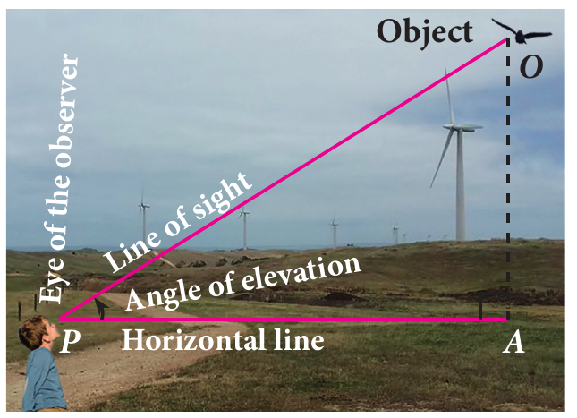

##### இறக்கக்கோணம் (Angle of Depression)

ஒரு பொருள் நம் கிடைநிலைக் பார்வைக்கோட்டிற்குக் கீழே இருக்கும்போது, பார்வைக்கோட்டிற்கும் கிடைநிலைப் பார்வைக் கோட்டிற்கும் இடையேயுள்ள கோணம் இறக்கக்கோணம் எனப்படும். அதாவது அப்பொருளைப் பார்க்க நாம் தலையைச் சற்றே தாழ்த்தும் நிலையே ஆகும் (படம் 6.8ஐ பார்க்கவும்).

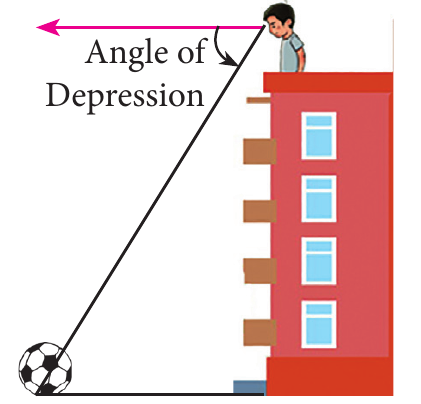

##### கிளைனோ மீட்டர் (Clinometer)

பொதுவாக ஏற்றக்கோணம் மற்றும் இறக்கக்கோணங்களைக் கிளைனோ மீட்டர் என்ற கருவியின் மூலம் கண்டறியலாம்.

> **குறிப்பு**
>
> - கொடுக்கப்பட்ட புள்ளியிலிருந்து ஒரு பொருளின் உயரம் அதிகரிக்கும்போது அதன் ஏற்றக் கோணத்தின் அளவு அதிகரிக்கும்.
>
>   $h_1 > h_2$ எனில், $\alpha > \beta$ ஆகும்.
>
>   
>
> - செங்குத்தாக உள்ள கோபுரம் அல்லது கட்டிடம் போன்றவற்றின் அடியை நோக்கி நகரும்போது, அதன் ஏற்றக்கோணம் அதிகரிக்கும்.
>
>   $d_2 < d_1$ எனில், $\beta > \alpha$ ஆகும்.
>
>   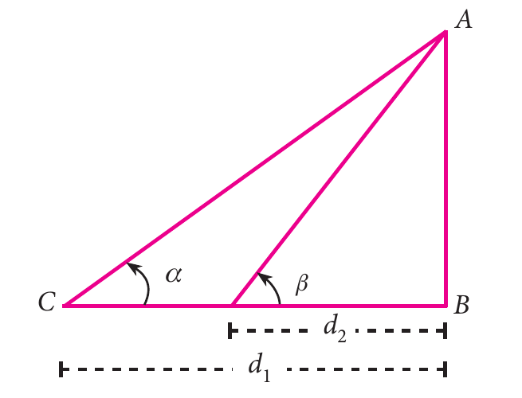

> **செயல்பாடு 2**
>
> கொடுக்கப்பட்ட சூழ்நிலைக்கு செங்கோண முக்கோணம் வரையவும்.
>
> | சூழ்நிலை | செங்கோண முக்கோணம் |
> |---|---|
> | ஒரு கோபுரம் தரைக்குச் செங்குத்தாக உள்ளது. அக்கோபுரத்தின் அடியிலிருந்து 20 மீ தொலைவில் உள்ள ஒரு புள்ளியிலிருந்து கோபுர உச்சிக்கான ஏற்றக்கோணம் $45^\circ$ ஆக இருக்கிறது. |  படம் 6.11 |
> | 1.8 மீ உயரமுள்ள ஒருவர், 25.2 மீ தொலைவில் உள்ள புகை போக்கியைப் பார்க்கிறார். அவரின் பார்வையிலிருந்து புகை போக்கியினுடைய உச்சியின் ஏற்றக்கோணம் $45^\circ$ ஆகும். | ……………………………… |
> | தரையின் மேல் $P$ என்ற புள்ளியிலிருந்து 20 மீ உயரமுள்ள கட்டடத்தின் உச்சியின் ஏற்றக்கோணம் $30^\circ$ ஆகும். கட்டடத்தின் உச்சியில் கொடி ஒன்று ஏற்றப்பட்டுள்ளது எனில், புள்ளி $P$-லிருந்து கொடிக்கம்பத்தினுடைய உச்சியின் ஏற்றக்கோணம் $55^\circ$ ஆகும். | ……………………………… |
> | சூரியனைக் காணும் ஏற்றக்கோணம் $60^\circ$-லிருந்து $30^\circ$ ஆக மாறும்போது சமதளத்தில் உள்ள ஒரு கோபுர நிழலின் நீளம் 40 மீ அதிகரிக்கிறது. | ………………………………… |

### 6.3.1 ஏற்றக் கோணக் கணக்குகள் (Problems involving Angle of Elevation)

இப்பகுதியில், ஏற்றக் கோணம் கொடுக்கப்பட்டிருந்தால் அக்கணக்குகளுக்குத் தீர்வு காணும் முறையை அறிவோம்.

#### எடுத்துக்காட்டு 6.18

பின்வரும் முக்கோணங்களில் $\angle BAC$-ஐ காண்க. ($\tan 38.7^\circ = 0.8011$, $\tan 69.4^\circ = 2.6604$)

**தீர்வு**

| (i) செங்கோண $\Delta ABC$-ல் (படம் 6.12 (i) பார்க்கவும்) | (ii) செங்கோண $\Delta ABC$-ல் (படம் 6.12 (ii) பார்க்கவும்) |
|---|---|
| $\tan\theta=\dfrac{\text{எதிர்ப்பக்கம்}}{\text{அடுத்துள்ள பக்கம்}}=\dfrac{4}{5}$ | $\tan\theta=\dfrac{8}{3}$ |
| $\tan\theta=0.8$ | $\tan\theta=2.66$ |
| $\Rightarrow\theta=38.7^\circ$ ($\because\tan 38.7^\circ=0.8011$) | $\Rightarrow\theta=69.4^\circ$ ($\because\tan 69.4^\circ=2.6604$) |
| $\therefore\angle BAC=38.7^\circ$ | $\therefore\angle BAC=69.4^\circ$ |

#### எடுத்துக்காட்டு 6.19

ஒரு கோபுரம் தரைக்குச் செங்குத்தாக உள்ளது. கோபுரத்தின் அடிப்பகுதியிலிருந்து தரையில் 48 மீ, தொலைவில் உள்ள ஒரு புள்ளியிலிருந்து கோபுர உச்சியின் ஏற்றக்கோணம் $30^\circ$ எனில், கோபுரத்தின் உயரத்தைக் காண்க.

**தீர்வு**

கோபுரத்தின் உயரம் $PQ$ என்க. $PQ = h$ என்க. கோபுரத்திற்கும் தரையில் உள்ள புள்ளி $R$-க்கும் இடைப்பட்ட தொலைவை $QR$ என்க.

செங்கோண $\Delta PQR$-ல் $\angle PRQ=30^\circ$

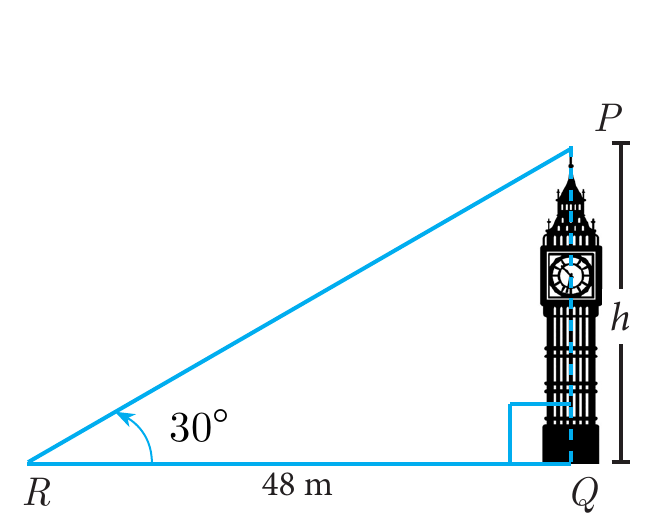

$$\begin{aligned}
\tan\theta&=\frac{PQ}{QR}\ ;\ \tan 30^\circ=\frac{h}{48}\\
\Rightarrow\quad \frac{1}{\sqrt{3}}&=\frac{h}{48}\ \text{எனவே,}\ h=16\sqrt{3}
\end{aligned}$$

ஆகவே, கோபுரத்தின் உயரம் $16\sqrt{3}$ மீ ஆகும்.

#### எடுத்துக்காட்டு 6.20

தரையிலிருந்து ஒரு பட்டம் 75 மீ உயரத்தில் பறக்கிறது. ஒரு நூல் கொண்டு தற்காலிகமாகத் தரையின் புள்ளியில் பட்டம் கட்டப்பட்டுள்ளது. நூல் தரையுடன் ஏற்படுத்தும் சாய்வுக் கோணம் $60^\circ$ எனில், நூலின் நீளம் காண்க. (நூலை ஒரு நேர்க்கோடாக எடுத்துக்கொள்ளவும்.)

**தீர்வு**

தரையிலிருந்து பட்டத்தின் உயரம் $AB = 75$ மீ என்க.

நூலின் நீளம் $AC$ என்க.

செங்கோண $\Delta ABC$-ல், $\angle ACB=60^\circ$

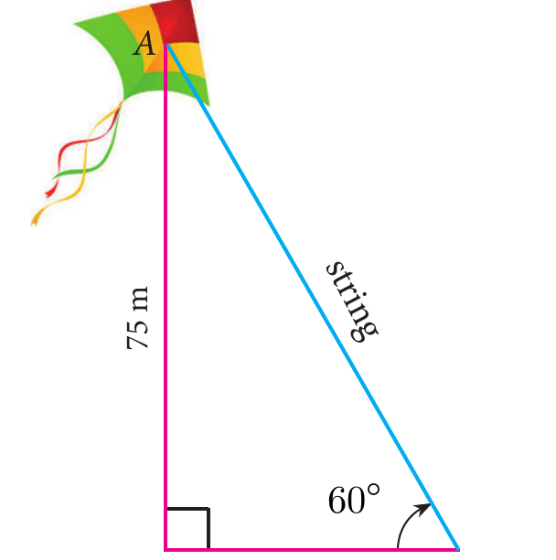

$$\begin{aligned}\sin\theta&=\frac{AB}{AC}\\\sin 60^\circ&=\frac{75}{AC}\\\Rightarrow\quad\frac{\sqrt{3}}{2}&=\frac{75}{AC}\Rightarrow AC=\frac{150}{\sqrt{3}}=50\sqrt{3}\end{aligned}$$

ஆகவே, நூலின் நீளம் $50\sqrt{3}$ மீ ஆகும்.

#### எடுத்துக்காட்டு 6.21

ஒரு கலங்கரை விளக்கத்தின் இருபுறமும் இரு கப்பல்கள் கடலில் பயணிக்கின்றன. கலங்கரை விளக்கத்தின் உச்சியின் ஏற்றக்கோணம் கப்பல்களில் இருந்து காணப்படும்போது முறையே $30^\circ$ மற்றும் $45^\circ$ ஆகும். கலங்கரை விளக்கத்தின் உயரம் 200 மீ எனில், இரு கப்பல்களுக்கும் இடையேயுள்ள தொலைவைக் காண்க. ($\sqrt{3}=1.732$)

**தீர்வு** கலங்கரை விளக்கம் $AB$ என்க. $C$ மற்றும் $D$ என்பன இரு கப்பல்கள் இருக்கும் இடங்கள் என்க.

மேலும், $AB = 200$ மீ.

$\angle ACB = 30^\circ$, $\angle ADB = 45^\circ$

செங்கோண $\Delta BAC$-ல்

$$\tan 30^\circ = \frac{AB}{AC}$$

$$\frac{1}{\sqrt{3}} = \frac{200}{AC} \Rightarrow AC = 200\sqrt{3} \qquad \ldots(1)$$

செங்கோண $\Delta BAD$ -ல் $\tan 45^\circ = \dfrac{AB}{AD}$

$$1 = \frac{200}{AD} \Rightarrow AD = 200 \qquad \ldots(2)$$

தற்போது, $CD = AC + AD = 200\sqrt{3} + 200$ &emsp; $[(1), (2)$ -லிருந்து$]$

$$CD = 200(\sqrt{3} + 1) = 200 \times 2.732 = 546.4$$

இரு கப்பல்களுக்கு இடையே உள்ள தொலைவு $546.4$ மீ ஆகும்.

#### எடுத்துக்காட்டு 6.22

தரையின்மீது ஒரு புள்ளியிலிருந்து $30$ மீ உயரமுள்ள கட்டடத்தின் மேலுள்ள ஒரு கோபுரத்தின் அடி மற்றும் உச்சியின் ஏற்றக்கோணங்கள் முறையே $45^\circ$ மற்றும் $60^\circ$ எனில், கோபுரத்தின் உயரத்தைக் காண்க. $(\sqrt{3} = 1.732)$

**தீர்வு** கோபுரத்தின் உயரம் $AC$ என்க. கட்டடத்தின் உயரம் $AB$ என்க.

மேலும் $AC = h$ மீ, $AB = 30$ மீ

செங்கோண $\Delta CBP$-ல் $\angle CPB = 60^\circ$

$$\tan\theta = \frac{BC}{BP}$$

$$\tan 60^\circ = \frac{AB+AC}{BP} \Rightarrow \sqrt{3} = \frac{30+h}{BP} \qquad \ldots(1)$$

செங்கோண $\Delta ABP$-ல், $\angle APB = 45^\circ$

$$\tan\theta = \frac{AB}{BP}$$

$$\tan 45^\circ = \frac{30}{BP} \Rightarrow BP = 30 \qquad \ldots(2)$$

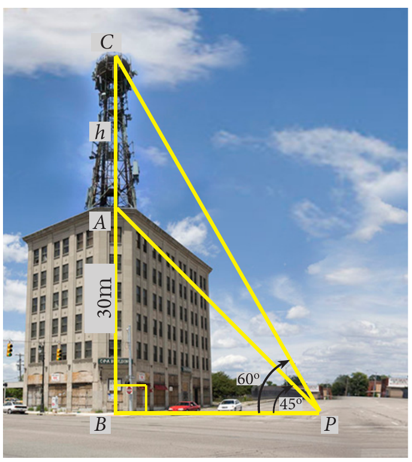

$(2)$-ஐ $(1)$-ல் பிரதியிட்டால் கிடைப்பது, $\sqrt{3} = \dfrac{30+h}{30}$

$$h = 30(\sqrt{3}-1) = 30(1.732-1) = 30(0.732) = 21.96$$

எனவே, கோபுரத்தின் உயரம் $= 21.96$ மீ.

#### எடுத்துக்காட்டு 6.23

ஒரு கால்வாயின் கரையில் ஒரு தொலைக்காட்சிக் கோபுரம் செங்குத்தாக உள்ளது. கால்வாயின் மறு கரையில் உள்ள ஒரு புள்ளியிலிருந்து காணும்பொழுது கோபுர உச்சியின் ஏற்றக்கோணம் $58^\circ$ ஆக உள்ளது. அப்புள்ளியிலிருந்து விலகி ஒரே நேர்க்கோட்டில் $20$ மீ தொலைவில் சென்றவுடன் கோபுர உச்சியின் ஏற்றக்கோணம் $30^\circ$ எனில், கோபுரத்தின் உயரத்தையும், கால்வாயின் அகலத்தையும் காண்க. $(\tan 58^\circ = 1.6003)$

**தீர்வு** தொலைக்காட்சிக் கோபுரத்தின் உயரம் $AB$ என்க.

கால்வாயின் அகலம் $BC$ என்க.

இங்கு, $CD = 20$ மீ.

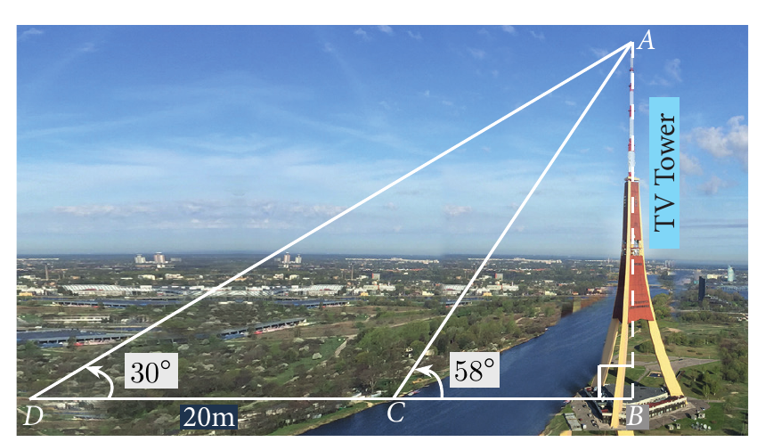

செங்கோண $\Delta ABC$ -ல்

$$\tan 58^\circ = \frac{AB}{BC}$$

$$1.6003 = \frac{AB}{BC} \qquad \ldots(1)$$

செங்கோண $\Delta ABD$ -ல்

$$\tan 30^\circ = \frac{AB}{BD} = \frac{AB}{BC+CD}$$

$$\frac{1}{\sqrt{3}} = \frac{AB}{BC+20} \qquad \ldots(2)$$

$(1)$-ஐ $(2)$ -ஆல் வகுக்கக் கிடைப்பது $\dfrac{1.6003}{\dfrac{1}{\sqrt{3}}} = \dfrac{BC+20}{BC}$

$$BC = \frac{20}{1.7717} = 11.29 \text{ மீ} \qquad \ldots(3)$$

$$1.6003 = \frac{AB}{11.29} \; [(1), (3) \text{ –லிருந்து}]$$

$$AB = 18.07$$

எனவே, கோபுரத்தின் உயரம் $= 18.07$ மீ, கால்வாயின் அகலம் $= 11.29$ மீ.

#### எடுத்துக்காட்டு 6.24

ஒரு விமானம் $G$-யிலிருந்து $24^\circ$ கோணத்தைத் தாங்கி $250$ கி.மீ தொலைவிலுள்ள $H$-ஐ நோக்கிச் செல்கிறது. மேலும் $H$-லிருந்து $55^\circ$ விலகி $180$ கி.மீ தொலைவிலுள்ள $J$-ஐ நோக்கிச் செல்கிறது எனில்,

(i) $G$-ன் வடக்கு திசையிலிருந்து $H$-ன் தொலைவு என்ன?

(ii) $G$-ன் கிழக்கு திசையிலிருந்து $H$-ன் தொலைவு என்ன?

(iii) $H$-ன் வடக்கு திசையிலிருந்து $J$-ன் தொலைவு என்ன?

(iv) $H$-ன் கிழக்கு திசையிலிருந்து $J$-ன் தொலைவு என்ன?

$$\begin{pmatrix} \sin 24^\circ = 0.4067 & \sin 11^\circ = 0.1908 \\ \cos 24^\circ = 0.9135 & \cos 11^\circ = 0.9816 \end{pmatrix}$$

**தீர்வு**

(i) செங்கோண $\Delta GOH$-ல் $\cos 24^\circ = \dfrac{OG}{GH}$

$$0.9135 = \frac{OG}{250}; \; OG = 228.38 \text{ கி.மீ}$$

$G$-ன் வடக்கு திசையிலிருந்து $H$-ன் தொலைவு $= 228.38$ கி.மீ.

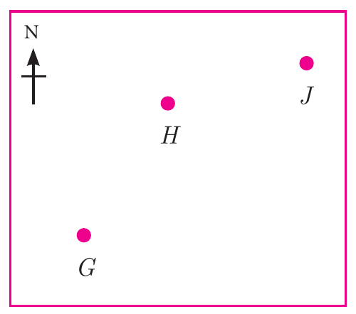

(ii) செங்கோண $\Delta GOH$-ல்,

$$\sin 24^\circ = \frac{OH}{GH}$$

$$0.4067 = \frac{OH}{250}; \; OH = 101.68$$

$G$-ன் கிழக்கு திசையிலிருந்து $H$-ன் தொலைவு $= 101.68$ கி.மீ.

(iii) செங்கோண $\Delta HIJ$-ல்,

$$\sin 11^\circ = \frac{IJ}{HJ}$$

$$0.1908 = \frac{IJ}{180}; \; IJ = 34.34 \text{ கி.மீ}$$

$H$-ன் வடக்கு திசையிலிருந்து $J$-ன் தொலைவு $= 34.34$ கி.மீ.

(iv) செங்கோண $\Delta HIJ$-ல்,

$$\cos 11^\circ = \frac{HI}{HJ}$$

$$0.9816 = \frac{HI}{180}; \; HI = 176.69 \text{ கி.மீ}$$

$H$-ன் கிழக்கு திசையிலிருந்து $J$-ன் தொலைவு $= 176.69$ கி.மீ.

#### எடுத்துக்காட்டு 6.25

படத்தில் உள்ளவாறு ஒரு சமதளத் தரையில் இரண்டு மரங்கள் உள்ளன. தரையில் உள்ள $X$ என்ற புள்ளியிலிருந்து இரு மர உச்சிகளின் ஏற்றக்கோணமும் $40^\circ$ ஆகும். புள்ளி $X$-லிருந்து சிறிய மரத்திற்கான கிடைமட்டத் தொலைவு $8$ மீ மற்றும் இரண்டு மரங்களின் உச்சிகளுக்குகிடையே உள்ள தொலைவு $20$ மீ எனில்,

(i) புள்ளி $X$-க்கும் சிறிய மரத்தின் உச்சிக்கும் இடைப்பட்ட தொலைவு

(ii) இரண்டு மரங்களுக்கும் இடையேயுள்ள கிடைமட்டத் தொலைவு $(\cos 40^\circ = 0.7660)$ ஆகியவற்றைக் கணக்கிடுக.

**தீர்வு** பெரிய மரத்தின் உயரம் $AB$ என்க. சிறிய மரத்தின் உயரம் $CD$ என்க. தரையில் உள்ள ஒரு புள்ளி $X$ என்க.

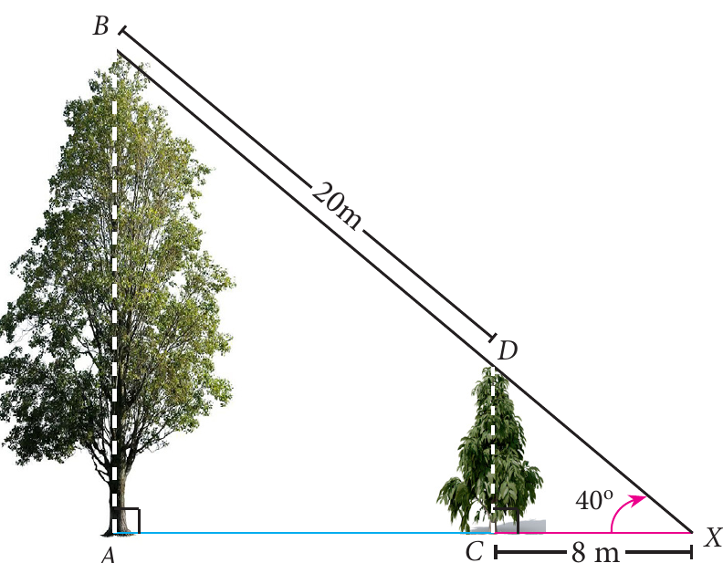

(i) செங்கோண $\Delta XCD$ -ல்

$$\cos 40^\circ = \frac{CX}{XD}$$

$$XD = \frac{8}{0.7660} = 10.44 \text{ மீ}$$

எனவே, புள்ளி $X$-க்கும் சிறிய மரத்தின் உச்சிக்கும் இடையே உள்ள தொலைவு $XD = 10.44$ மீ

(ii) செங்கோண $\Delta XAB$ -ல்

$$\cos 40^\circ = \frac{AX}{BX} = \frac{AC+CX}{BD+DX}$$

$$0.7660 = \frac{AC+8}{20+10.44} \Rightarrow AC = 23.32 - 8 = 15.32 \text{ மீ}$$

இரண்டு மரங்களுக்கு இடையேயுள்ள கிடைமட்டத் தொலைவு $AC = 15.32$ மீ.

> **சிந்தனைக் களம்**
>
> 1. உயரங்களையும், தொலைவுகளையும் கணக்கிடுவதற்கு எந்த வகையான முக்கோணத்தைப் பயன்படுத்துகிறோம்?
> 2. கட்டடத்தின் உயரம் மற்றும் கட்டடத்தின் அடியிலிருந்து ஏதேனும் ஒரு புள்ளிக்குமிடையே உள்ள தொலைவு கொடுக்கப்பட்டிருந்தால், அதன் ஏற்றக்கோணம் காண்பதற்கு எந்த முக்கோணவியல் விகிதத்தைப் பயன்படுத்த வேண்டும்?
> 3. பார்வைக்கோட்டின் நீளம் மற்றும் ஏற்றக்கோணம் கொடுக்கப்பட்டிருந்தால்,
>
>    (i) கட்டடத்தின் உயரத்தைக் காண்பதற்கும்
>
>    (ii) கட்டடத்தின் அடியிலிருந்து பார்க்கும் இடத்திற்குமிடையேயுள்ள தொலைவைக் காண்பதற்கும்
>
>    எந்த முக்காணவியல் விகிதத்தைப் பயன்படுத்த வேண்டும்.

### பயிற்சி 6.2

1. $10\sqrt{3}$ மீ உயரமுள்ள கோபுரத்தின் அடியிலிருந்து $30$ மீ தொலைவில் தரையில் உள்ள ஒரு புள்ளியிலிருந்து கோபுரத்தின் உச்சியின் ஏற்றக்கோணத்தைக் காண்க.

2. ஒரு சாலையின் இருபுறமும் இடைவெளியே இல்லாமல் வரிசையாக வீடுகள் தொடர்ச்சியாக உள்ளன. அவற்றின் உயரம் $4\sqrt{3}$ மீ. பாதசாரி ஒருவர் சாலையின் மையப் பகுதியில் நின்றுகொண்டு வரிசையாக உள்ள வீடுகளை நோக்குகிறார். $30^\circ$ ஏற்றக்கோணத்தில் பாதசாரி வீட்டின் உச்சியை நோக்குகிறார் எனில், சாலையின் அகலத்தைக் காண்க.

3. ஒருவர் அவருடைய வீட்டிற்கு வெளியில் நின்றுகொண்டு ஒரு ஜன்னலின் உச்சி மற்றும் அடி ஆகியவற்றை முறையே $60^\circ$ மற்றும் $45^\circ$ ஆகிய ஏற்றக்கோணங்களில் காண்கிறார். அவரின் உயரம் $180$ செ.மீ. மேலும் வீட்டிலிருந்து $5$ மீ தொலைவில் அவர் உள்ளார் எனில், ஜன்னலின் உயரத்தைக் காண்க $(\sqrt{3} = 1.732)$.

4. $1.6$ மீ உயரமுள்ள சிலை ஒன்று பீடத்தின் மேல் அமைந்துள்ளது. தரையிலுள்ள ஒரு புள்ளியிலிருந்து $60^\circ$ ஏற்றக்கோணத்தில் சிலையின் உச்சி அமைந்துள்ளது. மேலும் அதே புள்ளியிலிருந்து பீடத்தின் உச்சியானது $40^\circ$ ஏற்றக்கோணத்தில் உள்ளது எனில், பீடத்தின் உயரத்தைக் காண்க. $(\tan 40^\circ = 0.8391,\ \sqrt{3} = 1.732)$

5. '$r$' மீ ஆரம் கொண்ட அரைக் கோளக் குவிமாடத்தின் மீது '$h$' மீ உயரமுள்ள ஒரு கொடிக்கம்பம் நிற்கிறது. குவிமாடத்தின் அடியிலிருந்து $7$ மீ தொலைவில் ஒருவர் நிற்கிறார். அவர் கொடிக்கம்பத்தின் உச்சியை $45^\circ$ ஏற்றக் கோணத்திலும் நிற்குமிடத்திலிருந்து மேலும் $5$ மீ தொலைவு விலகிச் சென்று கொடிக்கம்பத்தின் அடியை $30^\circ$ ஏற்றக் கோணத்திலும் பார்க்கிறார் எனில், (i) கொடிக்கம்பத்தின் உயரம் (ii) அரைக் கோளக் குவிமாடத்தின் ஆரம் ஆகியவற்றைக் காண்க. $(\sqrt{3} = 1.732)$

   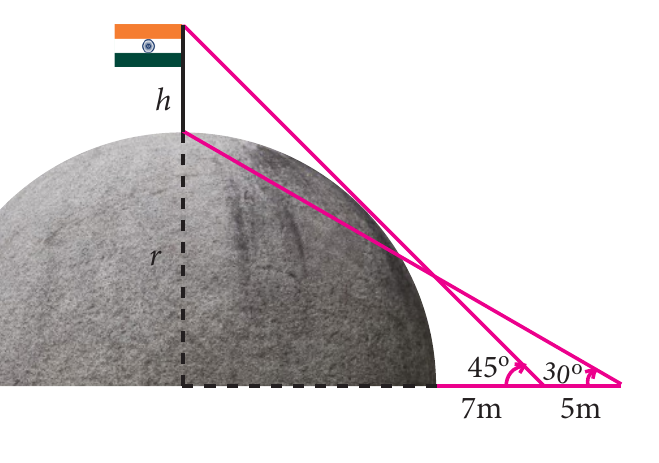

6. $15$ மீ உயரமுள்ள ஒரு கோபுரத்தின் உச்சியிலிருந்து ஒரு மின் கம்பத்தின் அடி மற்றும் உச்சியிலிருந்து முறையே $60^\circ$, $30^\circ$ என்ற ஏற்றக்கோணங்களில் பார்த்தால் மின் கம்பத்தின் உயரத்தைக் காண்க.

### 6.3.2 இறக்கக் கோணக் கணக்குகள் (Problems involving Angle of Depression)

இந்தப் பாடப்பகுதியில், இறக்கக் கோணங்களைக் கொண்டு கொடுக்கப்பட்டுள்ள கணக்குகளுக்குத் தீர்வு காணும் முறையை அறிவோம்.

> **குறிப்பு**
>
> ஏற்றக்கோணமும், இறக்கக் கோணமும் ஒன்றுவிட்ட கோணமாக இருப்பதால் அவை இரண்டும் சமமாக இருக்கும்.
>
> 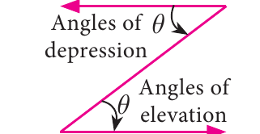

#### எடுத்துக்காட்டு 6.26

$20$ மீ உயரமுள்ள கட்டடத்தின் உச்சியில் ஒரு விளையாட்டு வீரர் அமர்ந்துகொண்டு தரையிலுள்ள ஒரு பந்தை $60^\circ$ இறக்கக்கோணத்தில் காண்கிறார் எனில், கட்டட அடிப்பகுதிக்கும் பந்திற்கும் இடையேயுள்ள தொலைவைக் காண்க. $(\sqrt{3} = 1.732)$

**தீர்வு** கட்டடத்தின் உயரம் $BC$ என்க. தரையில் பந்து இருக்கும் இடத்தை $A$ என்க. $BC = 20$ மீ, மேலும் $\angle XCA = 60^\circ = \angle CAB$

$AB = x$ மீ என்க.

செங்கோண $\Delta ABC$ -ல்

$$\tan 60^\circ = \frac{BC}{AB}$$

$$\sqrt{3} = \frac{20}{x}$$

$$x = \frac{20\times\sqrt{3}}{\sqrt{3}\times\sqrt{3}} = \frac{20\times 1.732}{3} = 11.55 \text{ மீ}$$

எனவே, கட்டடத்தின் அடிக்கும் பந்திற்கும் இடையேயுள்ள தொலைவு $= 11.55$ மீ.

#### எடுத்துக்காட்டு 6.27

இரண்டு கட்டடங்களுக்கு இடையேயுள்ள கிடைமட்டத் தொலைவு $140$ மீ. இரண்டாவது கட்டடத்தின் உச்சியிலிருந்து முதல் கட்டடத்தின் உச்சிக்கு உள்ள இறக்கக்கோணம் $30^\circ$ ஆகும். முதல் கட்டடத்தின் உயரம் $60$ மீ எனில் இரண்டாவது கட்டடத்தின் உயரத்தைக் காண்க. $(\sqrt{3} = 1.732)$

**தீர்வு** முதல் கட்டடத்தின் உயரம் $AB = 60$ மீ, மேலும் $AB = MD = 60$ மீ

இரண்டாவது கட்டடத்தின் உயரம் $CD = h$ என்க.

தொலைவு $BD = 140$ மீ

மேலும், $AM = BD = 140$ மீ

படத்திலிருந்து $\angle XCA = 30^\circ = \angle CAM$

செங்கோண $\Delta AMC$–ல்

$$\tan 30^\circ = \frac{CM}{AM}$$

$$\frac{1}{\sqrt{3}} = \frac{CM}{140}$$

$$CM = \frac{140}{\sqrt{3}} = \frac{140\sqrt{3}}{3}$$

$$= \frac{140\times 1.732}{3}$$

$$CM = 80.83$$

மேலும் $h = CD = CM + MD = 80.83 + 60 = 140.83$ மீ

ஆகவே, இரண்டாவது கட்டடத்தின் உயரம் $140.83$ மீ ஆகும்.

#### எடுத்துக்காட்டு 6.28

$50$ மீ உயரமுள்ள ஒரு கோபுரத்தின் உச்சியிலிருந்து ஒரு மரத்தின் உச்சி மற்றும் அடி ஆகியவற்றின் இறக்கக்கோணங்கள் முறையே $30^\circ$ மற்றும் $45^\circ$ எனில், மரத்தின் உயரத்தைக் காண்க. $(\sqrt{3} = 1.732)$

**தீர்வு** கோபுரத்தின் உயரம் $AB = 50$ மீ

மரத்தின் உயரம் $CD = y$ மற்றும் $BD = x$ என்க.

படத்திலிருந்து, $\angle XAC = 30^\circ = \angle ACM$ மற்றும் $\angle XAD = 45^\circ = \angle ADB$

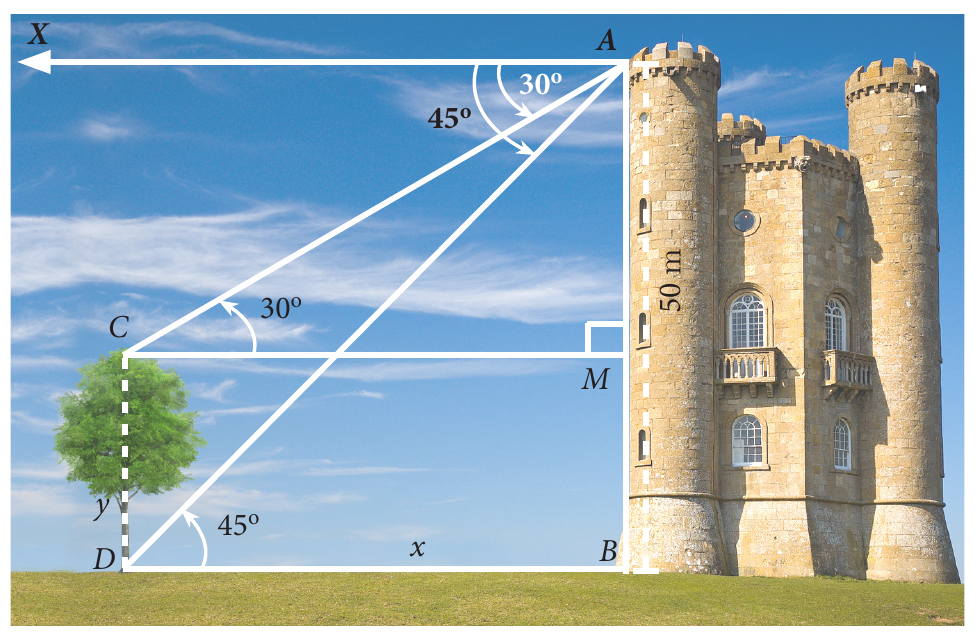

செங்கோண $\Delta ABD$-ல்

$$\tan 45^\circ = \frac{AB}{BD}$$

$$1 = \frac{50}{x} \Rightarrow x = 50 \text{ மீ}$$

செங்கோண $\Delta AMC$ -ல்

$$\tan 30^\circ = \frac{AM}{CM}$$

$$\frac{1}{\sqrt{3}} = \frac{AM}{50} \; [DB = CM \text{ என்பதால்}]$$

$$AM = \frac{50}{\sqrt{3}} = \frac{50\sqrt{3}}{3} = \frac{50\times 1.732}{3} = 28.87 \text{ மீ}$$

$$CD = MB = AB - AM = 50 - 28.87 = 21.13$$

எனவே, மரத்தின் உயரம் $21.13$ மீ ஆகும்.

#### எடுத்துக்காட்டு 6.29

$60$ மீ உயரமுள்ள கலங்கரை விளக்கத்தின் உச்சியிலிருந்து ஒருவர் கடல்மட்டத்திலுள்ள இரு கப்பல்களை முறையே $28^\circ$ மற்றும் $45^\circ$ இறக்கக்கோணத்தில் பார்க்கிறார். ஒரு கப்பல் மற்றொரு கப்பலுக்குப் பின்னால் ஒரே திசையில் கலங்கரை விளக்கத்துடன் நேர்க்கோட்டில் உள்ளது எனில், இரண்டு கப்பல்களுக்கும் இடையேயுள்ள தொலைவைக் காண்க. $(\tan 28^\circ = 0.5317)$

**தீர்வு** கலங்கரை விளக்கத்தின் உயரம் $CD$ என்க.

$D$ என்பது உற்று நோக்குபவர் இருக்கும் இடம் என்க.

கலங்கரை விளக்கத்தின் உயரம் $CD = 60$ மீ

படத்திலிருந்து,

$\angle XDA = 28^\circ = \angle DAC$ மற்றும்

$\angle XDB = 45^\circ = \angle DBC$

செங்கோண $\Delta DCB$–ல், $\tan 45^\circ = \dfrac{DC}{BC}$

$$1 = \frac{60}{BC} \Rightarrow BC = 60 \text{ மீ}$$

செங்கோண $\Delta DCA$-ல், $\tan 28^\circ = \dfrac{DC}{AC}$

$$0.5317 = \frac{60}{AC} \Rightarrow AC = \frac{60}{0.5317} = 112.85$$

இரண்டு கப்பல்களுக்கும் இடையேயான தொலைவு $AB = AC - BC = 52.85$ மீ.

#### எடுத்துக்காட்டு 6.30

ஒருவர், கோபுரத்திலிருந்து விலகி கடலில் சென்று கொண்டிருக்கும் படகு ஒன்றை, கோபுரத்தின் உச்சியிலிருந்து பார்க்கிறார். கோபுரத்தின் அடியிலிருந்து $200$ மீ தொலைவில் படகு இருக்கும்போது, படகை அவர் $60^\circ$ இறக்கக்கோணத்தில் காண்கிறார். $10$ வினாடிகள் கழித்து இறக்கக்கோணம் $45^\circ$ ஆக மாறுகிறது எனில், படகு செல்லும் வேகத்தினை (கி.மீ/மணியில்) தோராயமாகக் கணக்கிடுக. மேலும் படகு நிலையான தண்ணீரில் செல்கிறது எனக் கருதுக. $(\sqrt{3} = 1.732)$

**தீர்வு** $AB$ என்பது கோபுரம் என்க.

$C$ மற்றும் $D$ என்பன படகு இருக்கும் நிலைகள் என்க.

படத்திலிருந்து,

$\angle XAC = 60^\circ = \angle ACB$ மற்றும்

$\angle XAD = 45^\circ = \angle ADB$, $BC = 200$ மீ

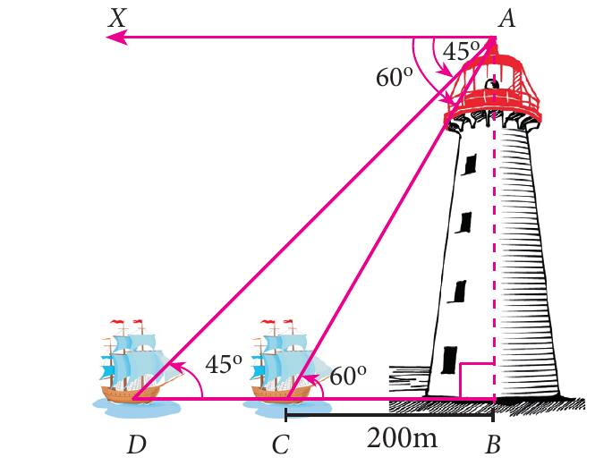

செங்கோண $\Delta ABC$ -ல் $\tan 60^\circ = \dfrac{AB}{BC}$

$$\sqrt{3} = \frac{AB}{200} \Rightarrow AB = 200\sqrt{3} \qquad \ldots(1)$$

செங்கோண $\Delta ABD$ -ல்

$$\tan 45^\circ = \frac{AB}{BD} \Rightarrow 1 = \frac{200\sqrt{3}}{BD} \; [(1) \text{ ... லிருந்து}]$$

எனவே, $BD = 200\sqrt{3}$

இப்போது, $CD = BD - BC$

$$CD = 200\sqrt{3} - 200 = 200(\sqrt{3}-1) = 146.4$$

$CD$ என்ற தொலைவை பயணிக்கத் தேவைப்படும் நேரம் $10$ வினாடிகள், எனக் கொடுக்கப்டுள்ளது.

அதாவது, $146.4$ மீ தொலைவை $10$ வினாடிகளில் படகு கடக்கிறது.

எனவே, படகின் வேகம் $= \dfrac{\text{தொலைவு}}{\text{காலம்}}$

$$= \frac{146.4}{10} = 14.64 \text{ மீ/வி} \Rightarrow 14.64\times\frac{3600}{1000} \text{ கி.மீ/மணி} = 52.704 \text{ கி.மீ/மணி}$$

### பயிற்சி 6.3

1. $50\sqrt{3}$ மீ உயரமுள்ள ஒரு பாறையின் உச்சியிலிருந்து $30^\circ$ இறக்கக்கோணத்தில் தரையிலுள்ள மகிழுந்து ஒன்று பார்க்கப்படுகிறது எனில், மகிழுந்திற்கும் பாறைக்கும் இடையேயுள்ள தொலைவைக் காண்க.

2. இரண்டு கட்டடங்களுக்கு இடைப்பட்ட கிடைமட்டத் தொலைவு $70$ மீ ஆகும். இரண்டாவது கட்டடத்தின் உச்சியிலிருந்து முதல் கட்டடத்தின் உச்சிக்கு உள்ள இறக்கக்கோணம் $45^\circ$ ஆகும். இரண்டாவது கட்டடத்தின் உயரம் $120$ மீ எனில் முதல் கட்டடத்தின் உயரத்தைக் காண்க.

3. $60$ மீ உயரமுள்ள கோபுரத்தின் உச்சியிலிருந்து செங்குத்தாக உள்ள ஒரு விளையாட்டு கம்பத்தின் உச்சி மற்றும் அடியின் இறக்கக்கோணங்கள் முறையே $38^\circ$ மற்றும் $60^\circ$ எனில், விளக்குக் கம்பத்தின் உயரத்தைக் காண்க. $(\tan 38^\circ = 0.7813,\ \sqrt{3} = 1.732)$

4. $1800$ மீ உயரத்தில் பறக்கும் ஒரு விமானத்திலிருந்து ஒரு திசையில் விமானத்தை நோக்கிச் செல்லும் இரு படகுகள் பார்க்கப்படுகிறது. விமானத்திலிருந்து இரு படகுகளை முறையே $60^\circ$ மற்றும் $30^\circ$ இறக்கக்கோணங்களில் உற்று நோக்கினால், இரண்டு படகுகளுக்கும் இடைப்பட்ட தொலைவைக் காண்க. $(\sqrt{3} = 1.732)$

5. ஒரு கலங்கரை விளக்கத்தின் உச்சியிலிருந்து எதிரெதிர் பக்கங்களில் உள்ள இரண்டு கப்பல்கள் $30^\circ$ மற்றும் $60^\circ$ இறக்கக்கோணத்தில் பார்க்கப்படுகின்றன. கலங்கரை விளக்கத்தின் உயரம் $h$ மீ. இரு கப்பல்கள் மற்றும் கலங்கரை விளக்கத்தின் அடிப்பகுதி ஆகியவை ஒரே நேர்க்கோட்டில் அமைகின்றன எனில், இரண்டு கப்பல்களுக்கு இடைப்பட்ட தொலைவு $\dfrac{4h}{\sqrt{3}}$ மீ என நிரூபிக்க.

6. $90$ அடி உயரமுள்ள கட்டடத்தின் மேலிருந்து ஒளி ஊடுருவும் கண்ணாடிச் சுவர் கொண்ட மின் தூக்கியானது கீழ் நோக்கி வருகிறது. கட்டடத்தின் உச்சியில் மின் தூக்கி இருக்கும்போது பூந்தோட்டத்தில் உள்ள ஒரு நீரூற்றின் இறக்கக்கோணம் $60^\circ$ ஆகும். இரண்டு நிமிடம் கழித்து அதன் இறக்கக்கோணம் $30^\circ$ ஆக குறைகிறது. மின்தூக்கியின் நுழைவு வாயிலிருந்து நீரூற்று $30\sqrt{3}$ அடி தொலைவில் உள்ளது எனில் மின்தூக்கி கீழே வரும் வேகத்தைக் காண்க.

### 6.3.3 ஏற்றக்கோணமும் இறக்கக்கோணமும் கொண்ட கணக்குகள் (Problems involving Angle of Elevation and Depression)

பின்வரும் சூழ்நிலையைக் கருத்தில் கொள்வோம். கடற்கரையில் அமைந்துள்ள கலங்கரை விளக்கத்தின் உச்சியின்மீது ஒருவர் நின்றுகொண்டு வானில் பறந்து கொண்டிருக்கின்ற விமானத்தைப் பார்க்கிறார். அதே வேளையில், கடலில் சென்று கொண்டிருக்கின்ற கப்பல் ஒன்றையும் பார்க்கிறார். அவர் விமானத்தை ஏற்றக்கோணத்திலும், கப்பலை இறக்கக்கோணத்திலும் காண்கிறார். இந்த எடுத்துக் காட்டிலிருந்து ஏற்றக்கோணம் மற்றும் இறக்கக்கோணம் ஒரே சூழ்நிலையில் பயன்படுகிறது என்பதை அறிகிறோம்.

படம் 6.26-ல் $x^\circ$ என்பது ஏற்றக்கோணம் மற்றும் $y^\circ$ என்பது இறக்கக்கோணம் ஆகும்.

இந்தப் பகுதியில் ஏற்றக்கோணமும், இறக்கக்கோணமும் கொடுக்கப்பட்டிருந்தால் அவ்வகை கணக்குகளுக்குத் தீர்வு காண முயல்வோம்.

#### எடுத்துக்காட்டு 6.31

$12$ மீ உயரமுள்ள கட்டடத்தின் உச்சியிலிருந்து மின்சாரக் கோபுர உச்சியின் ஏற்றக்கோணம் $60^\circ$ மற்றும் அதன் அடியின் இறக்கக்கோணம் $30^\circ$ எனில், மின்சாரக் கோபுரத்தின் உயரத்தைக் காண்க

**தீர்வு** படம் 6.27 -ல் $AO$ என்பது கட்டடம். $O$ என்பது கட்டடத்தின் உச்சிப் புள்ளி என்க. மேலும், $OA = 12$ மீ.

$PP'$ என்பது மின்சாரக் கோபுரம். இதில் $P$ என்பது மின் கோபுரத்தின் உச்சி, $P'$ என்பது மின் கோபுரத்தின் அடி.

$P$-யின் ஏற்றக்கோணம் $\angle MOP = 60^\circ$ மற்றும்

$P'$-ன் இறக்கக்கோணம் $\angle MOP' = 30^\circ$

மின் கோபுரத்தின் உயரம் $PP' = h$ மீ என்க.

$O$ வழியாக $OM \perp PP'$ வரைக.

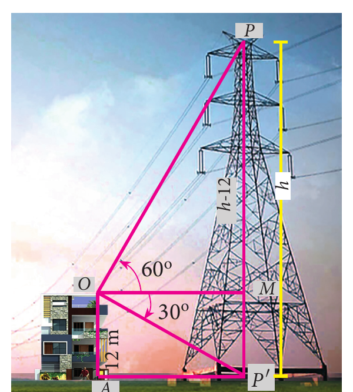

$$MP = PP' - MP' = h - OA = h - 12$$

செங்கோண $\Delta OMP$-ல் $\dfrac{MP}{OM} = \tan 60^\circ$

எனவே,

$$\frac{h-12}{OM} = \sqrt{3}$$

ஆகவே,

$$OM = \frac{h-12}{\sqrt{3}} \qquad \ldots(1)$$

செங்கோண $\Delta OMP'$-ல் $\dfrac{MP'}{OM} = \tan 30^\circ$

எனவே,

$$\frac{12}{OM} = \frac{1}{\sqrt{3}}$$

ஆகவே,

$$OM = 12\sqrt{3} \qquad \ldots(2)$$

$(1)$ மற்றும் $(2)$ –லிருந்து, $\dfrac{h-12}{\sqrt{3}} = 12\sqrt{3}$

எனவே, $h-12 = 12\sqrt{3}\times\sqrt{3}$ ஆகவே, $h = 48$

எனவே, மின் கோபுரத்தின் உயரம் $= 48$ மீ.

#### எடுத்துக்காட்டு 6.32

ஒரு கோபுர உச்சியின் மீது $5$ மீ உயரமுள்ள கம்பம் பொருத்தி வைக்கப்பட்டுள்ளது. தரையில் உள்ள '$A$' என்ற புள்ளியிலிருந்து கம்பத்தின் உச்சியை $60^\circ$ ஏற்றக்கோணத்திலும், கோபுரத்தின் உச்சியிலிருந்து '$A$' என்ற புள்ளியை $45^\circ$ இறக்கக் கோணத்திலும் பார்த்தால், கோபுரத்தின் உயரத்தைக் காண்க. $(\sqrt{3} = 1.732)$

**தீர்வு** கோபுரத்தின் உயரம் $BC$ என்க. கம்பத்தின் உயரம் $CD$ எனக் கொள்க.

உற்று நோக்குப் புள்ளி $A$ என்க

மேலும் $BC = x$ மற்றும் $AB = y$ என்க.

படத்தில்,

$\angle BAD = 60^\circ$ மற்றும் $\angle XCA = 45^\circ = \angle BAC$

செங்கோண $\Delta ABC$ –ல் $\tan 45^\circ = \dfrac{BC}{AB}$

எனவே, $1 = \dfrac{x}{y} \Rightarrow x = y \qquad \ldots(1)$

செங்கோண $\Delta ABD$ –ல்

$$\tan 60^\circ = \frac{BD}{AB} = \frac{BC+CD}{AB}$$

$$\sqrt{3} = \frac{x+5}{y} \Rightarrow \sqrt{3}\,y = x+5$$

எனவே, $\sqrt{3}\,x = x+5$ &emsp; $[(1)$-லிருந்து$]$

ஆகவே, $x = \dfrac{5}{\sqrt{3}-1} = \dfrac{5}{\sqrt{3}-1}\times\dfrac{\sqrt{3}+1}{\sqrt{3}+1} = \dfrac{5(1.732+1)}{2} = 6.83$

எனவே, கோபுரத்தின் உயரம் $= 6.83$ மீ.

#### எடுத்துக்காட்டு 6.33

ஒரு தெருவில் உள்ள ஒரு வீட்டின் சன்னலிலிருந்து, (சன்னல் தரைக்கு மேல் $h$ மீ உயரத்தில் உள்ளது) தெருவின் எதிர்ப் பக்கத்தில் உள்ள மற்றொரு வீட்டின் உச்சி, அடி ஆகியவற்றின் ஏற்றக்கோணம், இறக்கக்கோணம் முறையே $\theta_1$ மற்றும் $\theta_2$ எனில், எதிர்ப்பக்கத்தில் அமைந்த வீட்டின் உயரம் $h\left(1+\dfrac{\cot\theta_2}{\cot\theta_1}\right)$ என நிரூபிக்க.

**தீர்வு** படத்தில் $W$ என்பது சன்னலிலுள்ள ஒரு புள்ளி என்க. இப்புள்ளியிலிருந்து ஏற்றக்கோணமும், இறக்கக்கோணமும் கணக்கிடப்படுகிறது எனக் கொள்வோம். $PQ$ என்பது எதிர்ப்பக்கத்தில் உள்ள வீடு என்க.

$WA$ என்பது சன்னலிலிருந்து வீட்டிற்கு உள்ள தொலைவாகும்.

சன்னலின் உயரம் $= h = AQ$ $(WR = AQ)$

$PA = x$ மீ என்க.

செங்கோண $\Delta PAW$ –ல்

$$\tan\theta_1 = \frac{AP}{AW}$$

$$\tan\theta_1 = \frac{x}{AW}$$

$$\Rightarrow \quad AW = \frac{x}{\tan\theta_1}$$

ஆகவே, $AW = x\cot\theta_1 \qquad \ldots(1)$

செங்கோண $\Delta QAW$ –ல் $\tan\theta_2 = \dfrac{AQ}{AW}$

$$\tan\theta_2 = \frac{h}{AW}$$

$$AW = h\cot\theta_2 \qquad \ldots(2)$$

$(1)$ மற்றும் $(2)$ –லிருந்து, $x\cot\theta_1 = h\cot\theta_2$

$$x = h\frac{\cot\theta_2}{\cot\theta_1}$$

ஆகவே, எதிர்ப்பக்கத்தில் உள்ள வீட்டின் உயரம்

$$= PA+AQ = x+h = h\frac{\cot\theta_2}{\cot\theta_1}+h = h\left(1+\frac{\cot\theta_2}{\cot\theta_1}\right)$$

நிரூபிக்கப்பட்டது.

> **சிந்தனைக் களம்**
>
> உயரம், தொலைவு மற்றும் ஏற்றக்கோணம் காண்பதற்கு குறைந்தது எத்தனை அளவுகள் தேவை?

> **முன்னேற்றச் சோதனை**
>
> 1. உற்றுநோக்குபவரின் கண்ணிலிருந்து பொருளின் ஒரு புள்ளிக்கு வரையப்படும் கோடு __________ ஆகும்.
> 2. ஒரு பொருளை உற்றுநோக்கும்போது கிடைமட்டக் கோட்டிற்கும் பார்வைக்கோட்டிற்கும் இடைப்பட்ட கோணம் எக்கருவி மூலம் அளவிடப்படுகிறது?
> 3. பார்வைக்கோடானது கிடைமட்டக் கோட்டிற்கு மேலே இருக்கும்போது ஏற்படும் கோணம் __________ ஆகும்.
> 4. செங்குத்தாக உள்ள ஒரு பொருளின் (கோபுரம்) அடியை நோக்கிச் செல்லும்போது அதன் ஏற்றக்கோணம் __________.
> 5. பார்வைக்கோடானது கிடைமட்டக் கோட்டிற்குக் கீழே இருக்கும்போது ஏற்படும் கோணம் __________ ஆகும்

### பயிற்சி 6.4

1. $13$ மீ உயரமுள்ள ஒரு மரத்தின் உச்சியிலிருந்து மற்றொரு மரத்தின் உச்சி மற்றும் அடியின் ஏற்றக்கோணம் மற்றும் இறக்கக்கோணம் முறையே $45^\circ$ மற்றும் $30^\circ$ எனில், இரண்டாவது மரத்தின் உயரத்தைக் காண்க. $(\sqrt{3} = 1.732)$

2. கடலின் நீர் மட்டத்திலிருந்து $40$ மீட்டருக்கு மேல் உள்ள ஒரு கப்பலின் மேல் பகுதியில் நின்று கொண்டிருக்கிற ஒருவர், குன்றின் உச்சியை $60^\circ$ ஏற்றக்கோணத்திலும் அடிப்பகுதியை $30^\circ$ இறக்கக்கோணத்திலும் காண்கிறார் எனில், கப்பலிலிருந்து குன்றுக்கு உள்ள தொலைவையும், குன்றின் உயரத்தையும் காண்க. $(\sqrt{3} = 1.732)$

3. ஏரியின் நீர் மட்டத்திலிருந்து $h$ மீ உயரத்திலுள்ள ஒரு புள்ளியிலிருந்து ஒரு மேகத்தின் ஏற்றக்கோணம் $\theta_1$ மற்றும் ஏரி நீரில் விழும் மேகப் பிம்பத்தின் இறக்கக்கோணம் $\theta_2$ எனில், தரையிலிருந்து மேகத்தின் உயரம் $\dfrac{h(\tan\theta_1+\tan\theta_2)}{\tan\theta_2-\tan\theta_1}$ என நிரூபிக்கவும்.

4. உயரமான அடுக்குமாடி குடியிருப்பின் அடியிலிருந்து அலைபேசி கோபுர உச்சியின் ஏற்றக்கோணம் $60^\circ$ மற்றும் குடியிருப்பின் உச்சியிலிருந்து கோபுர அடியின் இறக்கக்கோணம் $30^\circ$ ஆகும். அடுக்குமாடி குடியிருப்பின் உயரம் $50$ மீ எனில் அலைபேசிக் கோபுரத்தின் உயரத்தைக் காண்க. கதிர்வீச்சுக் கட்டுப்பாடு விதியின்படி அலைபேசிக் கோபுரத்தின் குறைந்தபட்ச உயரம் $120$ மீ இருக்க வேண்டும். மேற்கண்ட அலைபேசிக்கோபுரம் இந்தக் கட்டுப்பாட்டிற்கு உட்படுகிறதா?

5. $66$ மீ உயரமான அடுக்குமாடிக் குடியிருப்பின் உச்சியிலிருந்து ஒரு விளக்குக் கம்பத்தின் உச்சி மற்றும் அடியின் ஏற்றக்கோணம் மற்றும் இறக்கக்கோணம் முறையே $60^\circ$, $30^\circ$ எனில் பின்வருவனவற்றைக் காண்க.

   (i) விளக்குக் கம்பத்தின் உயரம்.

   (ii) விளக்குக் கம்பத்தின் உயரத்திற்கும் அடுக்குமாடியின் உயரத்திற்கும் இடையேயுள்ள வித்தியாசம்.

   (iii) விளக்குக் கம்பத்திற்கும் அடுக்குமாடிக்கும் இடையே உள்ள தொலைவை. $(\sqrt{3} = 1.732)$

6. $A$, $B$ மற்றும் $C$ என்ற மூன்று கிராமவாசிகள் ஒரு பள்ளத்தாக்கில் ஒருவருக்கொருவர் தொலைநோக்கியில் பார்க்குமாறு உள்ளனர். $A$-க்கும், $B$-க்கும் இடைப்பட்ட கிடைமட்டத் தொலைவு $8$ கிமீ மற்றும் $B$-க்கும், $C$-க்கும் இடைப்பட்ட கிடைமட்டத் தொலைவு $12$ கிமீ. $A$-லிருந்து $B$-க்கு உள்ள இறக்கக்கோணம் $20^\circ$ மற்றும் $B$-லிருந்து $C$-க்கு உள்ள ஏற்றக்கோணம் $30^\circ$ எனில் பின்வருவனவற்றைக் கணக்கிடுக. (i) $A$-க்கும் $B$-க்கும் இடையேயுள்ள செங்குத்து உயரம். (ii) $B$-க்கும் $C$-க்கும் இடையேயுள்ள செங்குத்து உயரம். $(\tan 20^\circ = 0.3640,\ \sqrt{3} = 1.732)$

   

### பயிற்சி 6.5

##### பலவுள் தெரிவு வினாக்கள்

1. $\sin^2\theta + \dfrac{1}{1+\tan^2\theta}$ –ன் மதிப்பு

   (அ) $\tan^2\theta$ &emsp; (ஆ) $1$ &emsp; (இ) $\cot^2\theta$ &emsp; (ஈ) $0$

2. $\tan\theta\,\text{cosec}^2\theta - \tan\theta$ –ன் மதிப்பு

   (அ) $\sec\theta$ &emsp; (ஆ) $\cot^2\theta$ &emsp; (இ) $\sin\theta$ &emsp; (ஈ) $\cot\theta$

3. $(\sin\alpha+\text{cosec}\,\alpha)^2+(\cos\alpha+\sec\alpha)^2 = k+\tan^2\alpha+\cot^2\alpha$ எனில் $k$ –ன் மதிப்பு

   (அ) $9$ &emsp; (ஆ) $7$ &emsp; (இ) $5$ &emsp; (ஈ) $3$

4. $\sin\theta+\cos\theta = a$ மற்றும் $\sec\theta+\text{cosec}\,\theta = b$ எனில் $b(a^2-1)$ –ன் மதிப்பு

   (அ) $2a$ &emsp; (ஆ) $3a$ &emsp; (இ) $0$ &emsp; (ஈ) $2ab$

5. $5x=\sec\theta$ மற்றும் $\dfrac{5}{y}=\tan\theta$ எனில் $x^2-\dfrac{1}{y^2}$ –ன் மதிப்பு

   (அ) $25$ &emsp; (ஆ) $\dfrac{1}{25}$ &emsp; (இ) $5$ &emsp; (ஈ) $1$

6. $\sin\theta=\cos\theta$ எனில் $2\tan^2\theta+\sin^2\theta-1$ –ன் மதிப்பு

   (அ) $\dfrac{-3}{2}$ &emsp; (ஆ) $\dfrac{3}{2}$ &emsp; (இ) $\dfrac{2}{3}$ &emsp; (ஈ) $\dfrac{-2}{3}$

7. $x=a\tan\theta$ மற்றும் $y=b\sec\theta$ எனில்

   (அ) $\dfrac{y^2}{b^2}-\dfrac{x^2}{a^2}=1$ &emsp; (ஆ) $\dfrac{x^2}{a^2}-\dfrac{y^2}{b^2}=1$ &emsp; (இ) $\dfrac{x^2}{a^2}+\dfrac{y^2}{b^2}=1$ &emsp; (ஈ) $\dfrac{x^2}{a^2}-\dfrac{y^2}{b^2}=0$

8. $(1+\tan\theta+\sec\theta)(1+\cot\theta-\text{cosec}\,\theta)$ –ன் மதிப்பு

   (அ) $0$ &emsp; (ஆ) $1$ &emsp; (இ) $2$ &emsp; (ஈ) $-1$

9. $a\cot\theta+b\,\text{cosec}\,\theta=p$ மற்றும் $b\cot\theta+a\,\text{cosec}\,\theta=q$ எனில் $p^2-q^2$ –ன் மதிப்பு

   (அ) $a^2-b^2$ &emsp; (ஆ) $b^2-a^2$ &emsp; (இ) $a^2+b^2$ &emsp; (ஈ) $b-a$

10. ஒரு கோபுரத்தின் உயரத்திற்கும் அதன் நிழலின் நீளத்திற்கும் உள்ள விகிதம் $\sqrt{3}:1$, எனில் சூரியனைக் காணும் ஏற்றக்கோண அளவானது

    (அ) $45^\circ$ &emsp; (ஆ) $30^\circ$ &emsp; (இ) $90^\circ$ &emsp; (ஈ) $60^\circ$

11. ஒரு மின் கம்பமானது அதன் அடியில் சமதளப் பரப்பில் உள்ள ஒரு புள்ளியில் $30^\circ$ கோணத்தை ஏற்படுத்துகிறது. முதல் புள்ளிக்கு '$b$' மீ உயரத்தில் உள்ள இரண்டாவது புள்ளியிலிருந்து மின்கம்பத்தின் அடிக்கு இறக்கக்கோணம் $60^\circ$ எனில் மின் கம்பத்தின் உயரமானது (மீட்டரில்)

    (அ) $\sqrt{3}\,b$ &emsp; (ஆ) $\dfrac{b}{3}$ &emsp; (இ) $\dfrac{b}{2}$ &emsp; (ஈ) $\dfrac{b}{\sqrt{3}}$

12. ஒரு கோபுரத்தின் உயரம் $60$ மீ ஆகும். சூரியனைக் காணும் ஏற்றக்கோணம் $30^\circ$-லிருந்து $45^\circ$ ஆக உருரும்போது கோபுரத்தின் நிழலானது $x$ மீ குறைகிறது எனில், $x$-ன் மதிப்பு

    (அ) $41.92$ மீ &emsp; (ஆ) $43.92$ மீ &emsp; (இ) $43$ மீ &emsp; (ஈ) $45.6$ மீ

13. பல அடுக்குக் கட்டடத்தின் உச்சியிலிருந்து $20$ மீ உயரமுள்ள கட்டடத்தின் உச்சி, அடி ஆகியவற்றின் இறக்கக்கோணங்கள் முறையே $30^\circ$ மற்றும் $60^\circ$ எனில் பல அடுக்குக் கட்டடத்தின் உயரம் மற்றும் இரு கட்டடங்களுக்கு இடையேயுள்ள தொலைவானது (மீட்டரில்)

    (அ) $20,\ 10\sqrt{3}$ &emsp; (ஆ) $30,\ 5\sqrt{3}$ &emsp; (இ) $20,\ 10$ &emsp; (ஈ) $30,\ 10\sqrt{3}$

14. இரண்டு நபர்களுக்கு இடைப்பட்ட தொலைவு $x$ மீ ஆகும். முதல் நபரின் உயரமானது இரண்டாவது நபரின் உயரத்தைப் போல இரு மடங்காக உள்ளது. அவர்களுக்கு இடைப்பட்ட தொலைவு நேர்கோட்டின் மையப் புள்ளியிலிருந்து இரு நபர்களின் உச்சியின் ஏற்றக் கோணங்கள் நிரப்புக்கோணங்கள் எனில், குட்டையாக உள்ள நபரின் உயரம் (மீட்டரில்) காண்க.

    (அ) $\sqrt{2}\,x$ &emsp; (ஆ) $\dfrac{x}{2\sqrt{2}}$ &emsp; (இ) $\dfrac{x}{\sqrt{2}}$ &emsp; (ஈ) $2x$

15. ஓர் ஏரியின் மேலே $h$ மீ உயரத்தில் உள்ள ஒரு புள்ளியிலிருந்து மேகத்திற்கு உள்ள ஏற்றக்கோணம் $\beta$. மேக பிம்பத்தின் இறக்கக்கோணம் $45^\circ$ எனில், ஏரியில் இருந்து மேகத்திற்கு உள்ள உயரமானது (மீட்டரில்)

    (அ) $\dfrac{h(1+\tan\beta)}{1-\tan\beta}$ &emsp; (ஆ) $\dfrac{h(1-\tan\beta)}{1+\tan\beta}$ &emsp; (இ) $h\tan(45^\circ-\beta)$ &emsp; (ஈ) இவை ஒன்றும் இல்லை

## அலகு பயிற்சி - 6

1. நிரூபிக்கவும் (i) $\cot^2 A\left(\dfrac{\sec A-1}{1+\sin A}\right)+\sec^2 A\left(\dfrac{\sin A-1}{1+\sec A}\right)=0$ &emsp; (ii) $\dfrac{\tan^2\theta-1}{\tan^2\theta+1}=1-2\cos^2\theta$

2. $\left(\dfrac{1+\sin\theta-\cos\theta}{1+\sin\theta+\cos\theta}\right)^2 = \dfrac{1-\cos\theta}{1+\cos\theta}$ என்பதை நிருபிக்கவும்

3. $x\sin^3\theta+y\cos^3\theta=\sin\theta\cos\theta$ மற்றும் $x\sin\theta=y\cos\theta$ எனில், $x^2+y^2=1$ என நிருபிக்கவும்.

4. $a\cos\theta-b\sin\theta=c$ எனில் $(a\sin\theta+b\cos\theta)=\pm\sqrt{a^2+b^2-c^2}$ என நிருபிக்கவும்.

5. $80$ மீ உயரமுள்ள மரத்தின் உச்சியில் ஒரு பறவை இருக்கிறது. தரையில் உள்ள ஒரு புள்ளியிலிருந்து பறவையின் ஏற்றக்கோணம் $45^\circ$. பறவை ஒரே உயரத்தில் கிடைமட்டத்தில் பறந்து செல்கிறது. $2$ வினாடிகள் கழித்து அதே புள்ளியிலிருந்து பறவையின் ஏற்றக்கோணம் $30^\circ$ எனில், பறவை பறக்கும் வேகத்தினைக் காண்க. $(\sqrt{3} = 1.732)$

6. விமானம் ஒன்று புவிப் பரப்பிற்கு இணையாக $600$ மீ உயரத்தில் $175$ மீ/வி வேகத்தில் செல்கிறது. புவியின்மீது ஒரு புள்ளியிலிருந்து விமானத்திற்கு உள்ள ஏற்றக்கோணம் $37^\circ$ ஆகும். அதே புள்ளியிலிருந்து ஏற்றக்கோணம் $53^\circ$-க்கு அதிகரிக்க எவ்வளவு நேரம் தேவைப்படும்? $(\tan 53^\circ = 1.3270,\ \tan 37^\circ = 0.7536)$

7. ஒரு பறவை $A$ என்ற இடத்திலிருந்து $30$ கி.மீ தொலைவில் $B$ என்ற இடத்திற்கு $35^\circ$ கோணத்தில் பறக்கிறது. $B$-ல் $48^\circ$ கோணத்திலிருந்து விலகி $32$ கி.மீ தொலைவில் உள்ள $C$ என்ற இடத்திற்குச் செல்கிறது,

   (i) $A$-ன் வடக்குப் புறமாக $B$-ன் தொலைவு எவ்வளவு?

   (ii) $A$-ன் மேற்குப் புறமாக $B$-ன் தொலைவு எவ்வளவு?

   (iii) $B$-ன் வடக்குப் புறமாக $C$-ன் தொலைவு எவ்வளவு?

   (iv) $B$-ன் கிழக்குப் புறமாக $C$-ன் தொலைவு எவ்வளவு?

   $(\sin 55^\circ = 0.8192,\ \cos 55^\circ = 0.5736,\ \sin 42^\circ = 0.6691,\ \cos 42^\circ = 0.7431)$

8. கலங்கரை விளக்கம் இருக்கும் இடத்திலிருந்து கடலில் எதிரெதிர் திசையில் இரு கப்பல்கள் பயணம் செய்கின்றன. கலங்கரை விளக்கத்தின் உச்சியிலிருந்து இரு கப்பல்களின் இறக்கக்கோணங்கள் முறையே $60^\circ$ மற்றும் $45^\circ$. கப்பல்களுக்கு இடையே உள்ள தொலைவு $200\left(\dfrac{\sqrt{3}+1}{\sqrt{3}}\right)$ மீ எனில், கலங்கரை விளக்கத்தின் உயரம் காண்க.

9. ஒரு தெருவில் கட்டடமும், சிலையும் எதிரெதிர்த் திசையில் $35$ மீ இடைவெளியில் அமைந்துள்ளன. கட்டடத்தின் உச்சியிலிருந்து, சிலை உச்சியின் ஏற்றக்கோணம் $24^\circ$ மற்றும் சிலை அடியின் இறக்கக்கோணம் $34^\circ$ எனில், சிலையின் உயரம் என்ன?

   $(\tan 24^\circ = 0.4452,\ \tan 34^\circ = 0.6745)$

## நினைவில் கொள்ளவேண்டியவை

- முக்கோணவியல் விகிதங்களைக் கொண்ட சமன்பாடானது வரையறுக்கப்பட்ட கோணங்களின் அனைத்து மதிப்புகளுக்கும் மெய்யெனில் அச்சமன்பாட்டை முக்கோணவியல் முற்றொருமை என்கிறோம்.
- முக்கோணவியல் முற்றொருமைகள்

  (i) $\sin^2\theta+\cos^2\theta=1$ &emsp; (ii) $1+\tan^2\theta=\sec^2\theta$ &emsp; (iii) $1+\cot^2\theta=\text{cosec}^2\theta$

- நாம் ஒரு பொருளை உற்றுநோக்கும்போது நமது கண்ணிலிருந்து அப்பொருளுக்கு வரையப்படும் நேர்கோடு பார்வைக்கோடு எனப்படும்.
- கிடைநிலைக் கோட்டிற்கு மேல் பொருள் இருக்கும்போது, பார்வைக் கோட்டிற்கும் கிடைநிலைக் கோட்டிற்கும் இடையேயுள்ள கோணம் ஏற்றக்கோணம் எனப்படும்.
- கிடைநிலைக் கோட்டிற்குக் கீழ் பொருள் இருக்கும்போது, பார்வைக் கோட்டிற்கும் கிடைநிலைக் கோட்டிற்கும் இடையேயுள்ள கோணம் இறக்கக்கோணம் எனப்படும்.
- முக்கோணவியல் விகிதங்கள் மூலம் பொருட்களின் உயரம் அல்லது நீளம் அல்லது பொருட்களுக்கு இடைப்பட்ட தொலைவைக் கண்கிடலாம்.

## இணையச் செயல்பாடு (ICT)

### ICT 6.1

**படி 1:** கீழ்க்காணும் உரலி / விரைவுக் குறியீட்டைப் பயன்படுத்தி "Trigonometry" பக்கத்திற்கு செல்க. "Basic identity" எனும் பயிற்சித் தாளைத் தேர்வு செய்க.

**படி 2:** பயிற்சி தாளில் B என்ற புள்ளியை மாற்றுவதன் மூலம், முக்கோணத்தை மாற்றி அமைக்கலாம்.

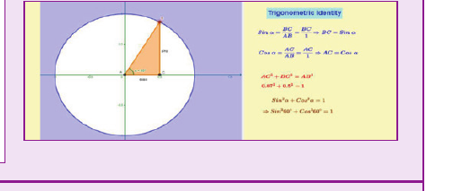

### ICT 6.2

**படி 1:** கீழ்க்காணும் உரலி / விரைவுக் குறியீட்டைப் பயன்படுத்தி "Trigonometry" பக்கத்திற்குச் செல்க. "heights and distance problem-1" எனும் பயிற்சித் தாளை தேர்வு செய்க.

**படி 2:** "New problem" –ஐ click செய்வதன் மூலம் புதிய கணக்குகளைப் பெற முடியும். கணக்குகளைத் தீர்த்த பின் விடையை சரிபார்க்க.

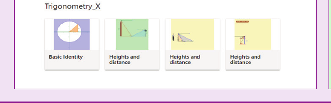

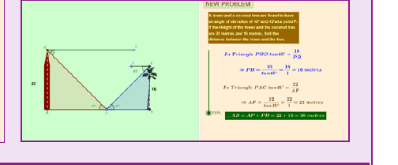

இந்தப் படிகளைக் கொண்டு மற்ற செயல்பாடுகளைச் செய்க.

[https://www.geogebra.org/m/jfr2zzgy#chapter/356196](https://www.geogebra.org/m/jfr2zzgy#chapter/356196)

அல்லது விரைவுச் செயலியை ஸ்கேன் செய்யவும்

